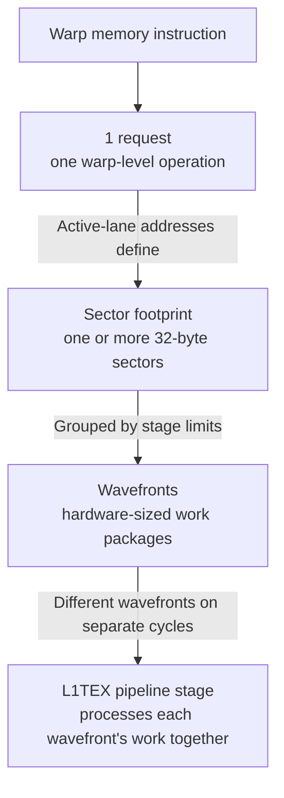
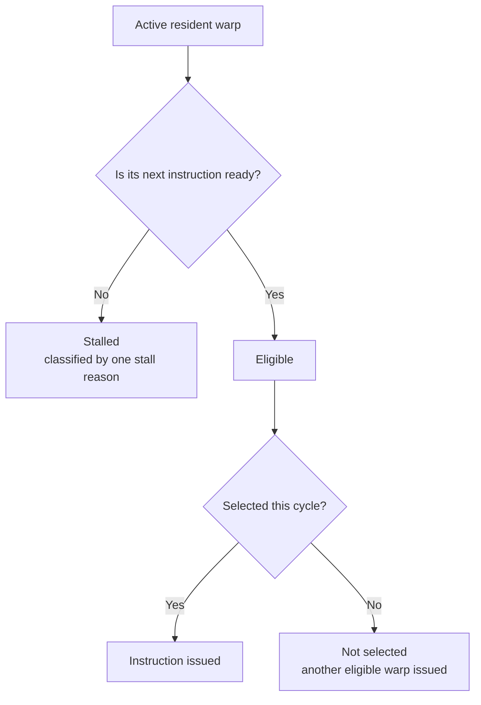
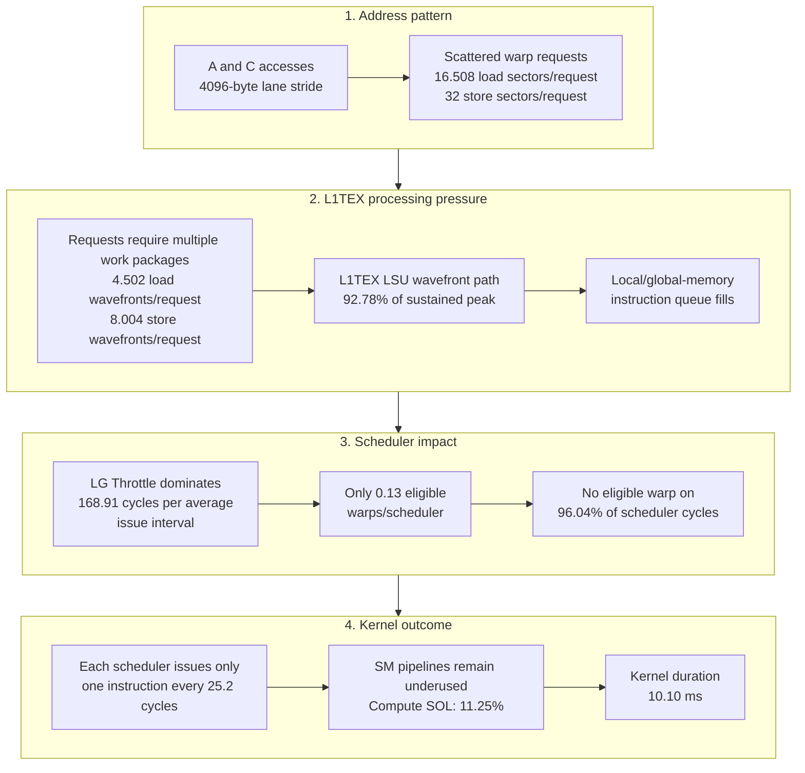

# 03 — Basic Uncoalesced GEMM

This case study explains the Nsight Compute measurements for the basic uncoalesced GEMM from first principles. It is deliberately detailed because the kernel is simple enough to predict exact request and sector counts. Its controlled follow-up is [04 — Basic Coalesced GEMM](04_basic_coalesced_gemm.md).

## Question

How does Nsight Compute reveal a known non-coalesced global-memory access pattern, and how do the memory counters connect to scheduler behavior and runtime?

## Capture context

**Facts**


| Item               | Value                             |
| ------------------ | --------------------------------- |
| Nsight Compute     | 2023.2.0                          |
| GPU                | NVIDIA RTX A6000                  |
| Compute capability | 8.6                               |
| SM count           | 84                                |
| Collection         | `--set full`                      |
| Replay passes      | 34                                |
| Kernel             | `device_gemm`                     |
| Problem            | `M=N=K=1024`                      |
| Grid               | `(32,32,1)` = 1,024 blocks        |
| Block              | `(32,32,1)` = 1,024 threads/block |
| Total threads      | 1,048,576                         |
| Registers/thread   | 40                                |
| Measured duration  | 10.097536 ms                      |


Relevant maintained source is in [03_basic_uncoalesced_gemm.cu](../03_basic_uncoalesced_gemm.cu):

- kernel and thread mapping: lines 69–81;
- problem dimensions: line 86;
- GPU layouts: lines 127–129;
- launch: lines 152–154.

## Kernel and warp mapping

The kernel maps threads as:

```cpp
int m = blockIdx.x * blockDim.x + threadIdx.x;
int n = blockIdx.y * blockDim.y + threadIdx.y;
```

CUDA linearizes `threadIdx.x` first. With `blockDim.x == 32`, each warp has:

- one fixed `threadIdx.y`, hence one fixed `n`;
- `threadIdx.x = 0..31`, hence 32 consecutive `m` values.

The actual CuTe strides are:

```cpp
A: make_stride(K, 1)
B: make_stride(1, K)
C: make_stride(N, 1)
```

For this `1024³` problem, the float-element offsets are:

```text
A(m,k) = 1024*m + k
B(k,n) = k + 1024*n
C(m,n) = 1024*m + n
```

The stride tuples determine the address mapping. For `A` and `C`, `(1024,1)` makes the second coordinate contiguous, while consecutive `m` values are 1,024 floats, or 4,096 bytes, apart.

### Predicted address behavior within one warp


| Access         | What varies across lanes? | Lane-to-lane byte distance | Predicted sectors/request |
| -------------- | ------------------------- | -------------------------- | ------------------------- |
| `A(m,k)`       | `m`                       | `1024 × 4 = 4096` bytes    | 32                        |
| `B(k,n)`       | nothing; `k,n` are fixed  | same address               | 1, efficient broadcast    |
| `C(m,n)` load  | `m`                       | 4,096 bytes                | 32                        |
| `C(m,n)` store | `m`                       | 4,096 bytes                | 32                        |


For 32 consecutive four-byte values, the normal coalesced footprint is 128 bytes, or four 32-byte sectors. An L1/TEX cache line is 128 bytes and is divided into four 32-byte sectors. For the `A` and `C` accesses, adjacent lanes address values 4,096 bytes apart. Since that distance is much larger than both a sector and a cache line, every lane's address falls in a different 32-byte sector and a different 128-byte cache line. A single warp request therefore touches 32 separate sectors and 32 separate cache lines.

## Reconstructing the request counts

**Where in the report:** open the **Details** page, expand **Memory Workload Analysis Tables**, and find the **L1/TEX Cache** table. The **Requests** column in the **Global Loads** and **Global Stores** rows contains the two counts used below.

The memory-request counts in this report come from these metrics:

- **Global Load Requests:** `l1tex__t_requests_pipe_lsu_mem_global_op_ld.sum`
- **Global Store Requests:** `l1tex__t_requests_pipe_lsu_mem_global_op_st.sum`

These metrics count the requests generated by warps when they execute global-memory load or store SASS instructions. A **request** is the warp-level memory operation sent to L1TEX. On Volta and newer GPUs, each executed global or local memory instruction generates exactly one such request. The active lanes supply their individual addresses, but those lane accesses are not counted as separate requests. L1TEX considers all the addresses from that warp instruction together and determines how many 32-byte sectors are needed to serve the request.

Therefore, **requests count warp memory operations**, while **sectors count the 32-byte memory regions touched by those operations**. For example:

- The `B` broadcast produces one request that touches one sector.
- A coalesced load of 32 consecutive `float` values produces one request that touches four sectors.
- Each uncoalesced `A` or `C` operation produces one request that touches 32 sectors.

The complete request–sector–wavefront mental model is:

> A request represents one warp-level memory operation. Its lane addresses determine the set of 32-byte sectors that must be accessed. L1TEX partitions the work for those sector accesses into one or more wavefronts. Each wavefront is a package of work that an L1TEX pipeline stage can process together, and multiple wavefronts from the same request are processed on separate cycles.



A wavefront is not a hardware unit; it is a package processed by one. Its contents depend on the access pattern and on what that L1TEX stage can handle together. All wavefronts derived from a request belong to that request; L1TEX does not combine sectors from separate requests into one wavefront.

Here, **accessed** does not necessarily mean fetched from a lower memory level. Every sector access still requires L1TEX request and tag processing. If the cache-line tag and the requested sector data are present, the sector is an L1 hit and the L1 data stage accesses it. For a load miss, L1TEX sends the request downstream to L2, and the returned data must later be handled and returned to the SM.

There are:

```text
1,048,576 threads / 32 threads per warp = 32,768 warps
```

Every warp performs 1,024 loop iterations. Each iteration contains one `A` load and one `B` load. The final expression loads `C` once and stores `C` once.

Predicted global-load requests:

```text
loop:   32,768 warps × 1,024 iterations × 2 loads = 67,108,864
C load: 32,768 warps × 1 load                      =     32,768
total                                                   67,141,632
```

Predicted global-store requests:

```text
32,768 warps × 1 store = 32,768
```

**Observation:** the report contains exactly 67,141,632 global-load requests and 32,768 global-store requests, matching the expected one L1TEX request per executed LSU memory instruction.

## Reconstructing the theoretical sectors

**Where in the report:** open the **Details** page and find **Source Counters**. Its uncoalesced-access message reports the total theoretical and excessive sector counts and points to the **L2 Theoretical Sectors Global Excessive** source hot-spot table. To see the exact whole-kernel value of each metric listed below, open the **Raw** page and search for its metric name. The **Source** page can be used to inspect the per-instruction attribution.

The Source Counters section compares the 32-byte sector footprint of the addresses actually generated by each warp with the footprint of an ideally coalesced access. It reports:

- **L2 Theoretical Sectors Global** (`memory_l2_theoretical_sectors_global`): the number of sectors touched by the warp's actual lane addresses, calculated by NCU.
- **L2 Theoretical Sectors Global Ideal** (`memory_l2_theoretical_sectors_global_ideal`): the number of sectors that would be touched for the same memory operation and access size if the lane accesses were coalesced as efficiently as possible.
- **L2 Theoretical Sectors Global Excessive** (`derived__memory_l2_theoretical_sectors_global_excessive`): the theoretical count minus the ideal count.

Here, **theoretical** means **computed**. `memory_l2_theoretical_sectors_global` is NCU's computed sector footprint for the actual address pattern. `memory_l2_theoretical_sectors_global_ideal` is the computed footprint for an ideally coalesced version of the same memory operation and access size. The derived metric `derived__memory_l2_theoretical_sectors_global_excessive` is the difference between those two counts.

For 32 lanes loading one four-byte `float` each, a contiguous access normally needs four sectors, while this kernel's scattered `A` and `C` accesses need 32. The `B` broadcast already needs only one sector, so its theoretical and ideal counts are both one.

### Dot-product line

The line

```cpp
dotprod += A(m, k) * B(k, n);
```

generates 32 `A` sectors and one `B` sector per warp iteration:

```text
theoretical sectors
= 32,768 warps × 1,024 iterations × (32 + 1)
= 1,107,296,256
```

Its ideal footprint preserves the efficient one-sector `B` broadcast and makes `A` contiguous:

```text
ideal sectors
= 32,768 × 1,024 × (4 + 1)
= 167,772,160
```

Therefore:

```text
excessive sectors for the dot-product expression
= 1,107,296,256 - 167,772,160
= 939,524,096
```


### Final C line

The line

```cpp
C(m,n) = C(m,n) + dotprod;
```

performs one scattered load and one scattered store:

```text
theoretical sectors = 32,768 × (32 + 32) = 2,097,152
ideal sectors       = 32,768 × ( 4 +  4) =   262,144
excessive sectors                                1,835,008
```


### Whole-kernel source model

```text
theoretical global sectors = 1,109,393,408
ideal global sectors       =   168,034,304
excessive sectors          =   941,359,104
excessive fraction         =         84.85%
```

**Observation:** all four values match the Source Counters rule and its source-line attribution exactly.

The measured L1 table reports 1,108,344,767 global-load sectors. Dividing by 67,141,632 load requests gives 16.508 sectors/request. Stores produce exactly:

```text
1,048,576 sectors / 32,768 requests = 32 sectors/request
```

The load average is dominated by the two loop loads:

```text
(32 A sectors + 1 B sector) / 2 requests = 16.5 sectors/request
```

The single `C` load per warp changes the whole-kernel average only slightly.

## What “throughput” means here

A throughput percentage says how close a hardware component came to its sustainable peak processing rate for the kind of work that component performs. In this report, the limiting work is **L1TEX LSU wavefront processing**, not DRAM byte transfer:

- `l1tex__data_pipe_lsu_wavefronts.avg.pct_of_peak_sustained_elapsed = 92.78%` means that the L1TEX LSU data pipe processed wavefronts at 92.78% of its sustainable peak rate over all elapsed cycles.
- `gpu__compute_memory_throughput.avg.pct_of_peak_sustained_elapsed = 92.78%` is the compound Memory Throughput metric. It reports the largest memory constituent, so it repeats the L1TEX LSU-wavefront value.
- `l1tex__throughput.avg.pct_of_peak_sustained_active = 98.96%` reports L1TEX throughput only during cycles in which L1TEX was active.

The core reading is that the **L1TEX LSU processing path is near its limit**. It does not mean the entire memory hierarchy or DRAM bandwidth is at 92.78%; DRAM Throughput is only 0.22%.

## Key observations

The tables below deliberately separate **what a metric measures** from **what its value implies for this kernel**. No single value proves the diagnosis by itself; the diagnosis comes from the way the access-pattern, hardware-throughput, and scheduler metrics agree.

### Runtime and throughput

Find the headline metrics in **Details → GPU Speed Of Light Throughput**. Within that section, find their constituents under **GPU Throughput Breakdown → Compute Throughput Breakdown** and **Memory Throughput Breakdown**.


| UI label                     | Raw metric                                                          | Value    | What the metric measures                                                                                                                                                                            | Observation for this kernel                                                                                                                                                                                                                       |
| ---------------------------- | ------------------------------------------------------------------- | -------- | --------------------------------------------------------------------------------------------------------------------------------------------------------------------------------------------------- | ------------------------------------------------------------------------------------------------------------------------------------------------------------------------------------------------------------------------------------------------- |
| Duration                     | `gpu__time_duration.sum`                                            | 10.10 ms | The GPU execution duration NCU reports for this profiled kernel instance.                                                                                                                           | This is the performance outcome to compare with later kernel variants. It tells us how long the kernel ran, but not why it took that long.                                                                                                        |
| Memory Throughput            | `gpu__compute_memory_throughput.avg.pct_of_peak_sustained_elapsed`  | 92.78%   | A compound SOL value: the largest peak-normalized processing rate among the selected memory-hierarchy constituents, measured over all elapsed cycles.                                               | At least one memory component is near its sustainable processing limit. This does not mean the whole memory hierarchy or DRAM is 92.78% utilized; the breakdown identifies the L1TEX LSU-wavefront path as the source.                            |
| L1: Data Pipe Lsu Wavefronts | `l1tex__data_pipe_lsu_wavefronts.avg.pct_of_peak_sustained_elapsed` | 92.78%   | The rate at which the L1TEX LSU data pipe processes wavefront work packages, as a percentage of its sustained peak over all elapsed cycles. This measures wavefront work, not bytes or busy cycles. | This is the constituent driving the 92.78% Memory Throughput headline. The scattered requests create multiple wavefronts, keeping this processing path near its limit.                                                                            |
| L1/TEX Cache Throughput      | `l1tex__throughput.avg.pct_of_peak_sustained_active`                | 98.96%   | A compound peak-normalized L1TEX throughput value calculated only over cycles in which L1TEX was active.                                                                                            | When active, the busiest L1TEX path operates almost at its sustainable peak. The L1TEX subunits were active for about 93.75% of their aggregate elapsed cycles; `98.96% × 93.75% ≈ 92.78%`, so this pressure persists through most of the kernel. |
| L2 Cache Throughput          | `lts__throughput.avg.pct_of_peak_sustained_elapsed`                 | 1.67%    | A compound value reporting the largest peak-normalized rate among L2 processing paths over all elapsed cycles. It is not solely L2 byte bandwidth.                                                  | The largest L2 constituent is **L2: Xbar2lts Cycles Active**, also at 1.67%. No L2 path is near capacity, so L2 is not the limiting level.                                                                                                        |
| DRAM Throughput              | `gpu__dram_throughput.avg.pct_of_peak_sustained_elapsed`            | 0.22%    | A compound value reporting the largest peak-normalized rate among DRAM constituents over all elapsed cycles. It is not itself a pure byte-bandwidth percentage.                                     | The largest constituent is **DRAM: Cycles Active** at only 0.22%, while measured DRAM bandwidth is 1.59 GB/s. DRAM is far from saturation, so this is not a DRAM-bandwidth-bound kernel.                                                          |
| Compute (SM) Throughput      | `sm__throughput.avg.pct_of_peak_sustained_elapsed`                  | 11.25%   | A compound value reporting the largest peak-normalized rate among SM processing pipelines over all elapsed cycles. It is not specifically FP32 or FLOP throughput.                                  | The largest SM constituent is **SM: Inst Executed Pipe Lsu** at 11.25%; FMA-heavy activity is only 5.63% and Issue Active is 3.72%. Arithmetic and issue capacity are underused while LSU work is the busiest SM path.                            |


### Address pattern and cache behavior

Find the hit rates in **Details → Memory Workload Analysis**. Find the request and sector counters in **Details → Memory Workload Analysis Tables → L1/TEX Cache**. Find excessive sectors in **Details → Source Counters**, or search for its raw metric name on the **Raw** page.


| UI label                                | Raw metric or calculation                                                                            | Value                | What the metric measures                                                                                                        | Observation for this kernel                                                                                                                                                                                                                      |
| --------------------------------------- | ---------------------------------------------------------------------------------------------------- | -------------------- | ------------------------------------------------------------------------------------------------------------------------------- | ------------------------------------------------------------------------------------------------------------------------------------------------------------------------------------------------------------------------------------------------ |
| Global Loads — Sectors/Req              | `l1tex__t_sectors_pipe_lsu_mem_global_op_ld.sum` ÷ `l1tex__t_requests_pipe_lsu_mem_global_op_ld.sum` | 16.508               | The average number of distinct 32-byte L1 sectors touched by one warp-level global-load request.                                | This average is dominated by the repeated 32-sector `A` request and one-sector `B` broadcast. It is direct evidence that the loads are poorly coalesced; it does not mean every individual load touches 16.508 sectors.                          |
| Global Stores — Sectors/Req             | `l1tex__t_sectors_pipe_lsu_mem_global_op_st.sum` ÷ `l1tex__t_requests_pipe_lsu_mem_global_op_st.sum` | 32.000               | The average number of distinct 32-byte L1 sectors touched by one warp-level global-store request.                               | Every lane's `C` address falls in a different sector. The request therefore uses 32 sectors instead of the four sectors needed for 32 contiguous `float` stores.                                                                                 |
| Global Loads/Stores — Wavefronts/Req    | L1TEX **Wavefronts** ÷ **Requests** in the corresponding rows                                        | 4.502 / 8.004        | The average number of internal L1TEX work packages needed to process each global-load or global-store request.                  | Sectors/request describes the scattered address footprint; wavefronts/request shows the serialized internal processing pressure created by that footprint. Multiple wavefronts per request help explain the high L1TEX LSU-wavefront throughput. |
| L2 Theoretical Sectors Global Excessive | `derived__memory_l2_theoretical_sectors_global_excessive`                                            | 941,359,104 (84.85%) | The computed sector footprint of the actual global-memory address pattern minus the footprint of the ideally coalesced pattern. | About 84.85% of the computed sectors are avoidable relative to the ideally coalesced pattern. This is the strongest source-level evidence that the address layout is the root problem.                                                           |
| L1/TEX Hit Rate                         | `l1tex__t_sector_hit_rate.pct`                                                                       | 99.20%               | The fraction of L1TEX sector lookups that hit. This is not a request hit rate or a coalescing-efficiency metric.                | Most L1 sector lookups hit, greatly reducing miss traffic sent downstream. Because the address pattern requests many more sectors than ideal, the high hit rate still leaves substantial L1TEX processing work.                                  |
| L2 Hit Rate                             | `lts__t_sector_hit_rate.pct`                                                                         | 95.89%               | The fraction of L2 sector lookups that hit.                                                                                     | Most sector lookups that reach L2 find their data there. Together with the 0.22% DRAM Throughput value, this shows that downstream DRAM pressure is low.                                                                                         |


### Scheduler and warp stalls

Each SMSP scheduler owns a pool of resident **active warps**. On every scheduler cycle, it examines the next instruction of each warp:



A warp is **eligible** only when its next instruction is decoded, its input dependencies are ready, and the required execution path can accept it. A **stall reason belongs to one warp's next instruction**, not to the scheduler as a whole. Several warps can be stalled for different reasons while the scheduler issues an instruction from another eligible warp.

#### 1. Scheduler metrics

Find these metrics in **Details → Scheduler Statistics**.

Scheduler metrics observe each SMSP scheduler as a whole. Their basic unit is a **scheduler-active cycle**: they report how many warps are resident or eligible on an average cycle and whether the scheduler found a warp from which to issue.

| UI label | Raw metric | Value | Interpretation |
|---|---|---:|---|
| Active Warps Per Scheduler | `smsp__warps_active.avg.per_cycle_active` | 7.88 warps | On an average scheduler-active cycle, each scheduler has 7.88 resident, unfinished warps. These warps are assigned to the scheduler, but they are not necessarily ready to issue; the count also includes warps whose next instruction is stalled. |
| Eligible Warps Per Scheduler | `smsp__warps_eligible.avg.per_cycle_active` | 0.13 warps | On an average scheduler-active cycle, each scheduler has only 0.13 eligible warps—active warps whose next instruction is ready to issue. The average includes cycles with no eligible warps; each individual cycle still has an integer number of eligible warps. |
| Issued Warp Per Scheduler | `smsp__issue_active.avg.per_cycle_active` | about 0.04 | This is the average number of warps selected to issue per scheduler-active cycle. Each cycle contributes either `1` when a warp is selected or `0` when no warp is eligible; averaging those values gives `0.0396`, the decimal form of the 3.96% issue-active rate shown in the next row. |
| One or More Eligible | `smsp__issue_active.avg.pct_of_peak_sustained_active` | 3.96% | Among all scheduler-active cycles, only 3.96% have at least one eligible warp. The scheduler issues on these cycles, which means that it issues on one out of every 25.2 scheduler-active cycles on average. This is a percentage of cycles, not a percentage of warps. |
| No Eligible | `smsp__issue_inst0.avg.pct_of_peak_sustained_active` | 96.04% | Among all scheduler-active cycles, 96.04% have no eligible warp, so the scheduler leaves its issue slot unused. This is the complement of **One or More Eligible** and directly measures how often the scheduler cannot issue because no warp is ready. |

All five metrics use scheduler-active cycles as their time basis. **Active Warps**, **Eligible Warps**, and **Issued Warp** report average warp counts per cycle. **One or More Eligible** reports the percentage of total scheduler-active cycles in which at least one warp was eligible, while **No Eligible** reports the percentage in which no warp was eligible.

The scheduler has nearly all eight warps allowed by this launch, but almost none are ready. The issue slot is unused on 96.04% of active cycles because the scheduler cannot find an eligible warp. The immediate scheduler-level problem is therefore **warp readiness**, not a lack of resident warps.

#### 2. Warp metrics

Find these metrics in **Details → Warp State Statistics**, especially the **Warp State (All Cycles)** chart.

Warp metrics view execution from each active warp's point of view. Use this mental model:

1. **NCU defines a set of warp states.** Most are stall states that explain why a warp's next instruction cannot issue, such as **LG Throttle** and **Long Scoreboard**. The set also includes **Not Selected**, for an eligible warp that was ready but not chosen, and **Selected**, for the warp chosen to issue.
2. **Every active warp is classified separately.** On each scheduler-active cycle, every active warp contributes one counted cycle to exactly one of these states.
3. **The counts are accumulated by state over the kernel.** The unnormalized total for a state is the number of cycles contributed by all warps while they were in that state. The same warp can contribute on many cycles, so this is not the number of distinct warps that experienced the state.
4. **Each state total is normalized into an average issue interval.** NCU divides the accumulated state total by the number of issue-active scheduler cycles. The result describes the average cycles contributed to that state across active warps from one issue-active cycle to the next. On this GA102 GPU, one issue-active cycle corresponds to one issued warp instruction, so the UI reports the unit as cycles per issued instruction.

The same state accounting can therefore be viewed in two forms:

| Form | How it is calculated | What it means |
|---|---|---|
| **Whole-kernel total** (unnormalized numerator) | Sum one cycle for every active warp on every cycle in which it occupies that state. | The total number of per-warp cycle contributions accumulated in that state over the kernel. It is neither elapsed scheduler time nor a count of distinct warps, because several warps can contribute on one cycle and one warp can contribute on many cycles. |
| **Normalized chart value** (UI unit: cycles per issued instruction) | Divide the whole-kernel state total by the number of issue-active scheduler cycles. | The average number of cycles contributed to that state across active warps during one average issue interval. |

For the normalized view, let `X` be the average spacing, measured in scheduler-active cycles, from one issue-active cycle to the next, and `W` the average number of active resident warps per scheduler-active cycle:

```text
N = X × W
  ≈ sum of all warp-state values
```

`N` is the average total number of state cycles contributed by active warps during one issue interval. Each warp-state value shows how much of `N` is attributed to **LG Throttle**, **Long Scoreboard**, **Selected**, **Not Selected**, or another state. This is an average over the whole kernel: the spacing between issue-active cycles, the number of resident warps, and their state distribution can vary from one interval to another.

Suppose a scheduler has eight active warps during one cycle:

- six are stalled by LG Throttle;
- one is stalled by Long Scoreboard;
- one is selected and issues an instruction.

Although only one scheduler cycle elapsed, the warp-state accounting counts that cycle from all eight warps' points of view: six cycles are added to LG Throttle, one to Long Scoreboard, and one to Selected. The scheduler still issued an instruction in that cycle. If all eight warps had been stalled, the same scheduler cycle would add eight cycles across the stall states and zero issued instructions.

The **Warp State (All Cycles)** chart therefore shows how active warps, on average, distribute their state cycles over the interval from one issue-active cycle to the next. Because each warp contributes separately, the chart is not a scheduler-cycle timeline; and because it includes **Selected** and **Not Selected**, it is not only a list of stall reasons. **All Cycles** means that all scheduler-active cycles contribute to the whole-kernel numerator; the displayed bars are still normalized by issue-active cycles.

The most important warp metrics in this report are shown below. Each reported value describes one state's average contribution during an issue interval. The **What NCU counts** column describes the whole-kernel numerator from which that average is calculated.

| UI label | Raw metric | Value | What NCU counts | How to read this value |
|---|---|---:|---|---|
| Warp Cycles Per Issued Instruction | `smsp__average_warp_latency_per_inst_issued.ratio` | 198.87 | On every scheduler-active cycle, NCU counts one cycle for every active warp, regardless of that warp's state. This is the sum of the counts for all states. | During one average issue interval, active warps contribute 198.87 cycles across all warp states. Several warps can contribute during the same scheduler cycle. |
| Stall LG Throttle | `smsp__average_warps_issue_stalled_lg_throttle_per_issue_active.ratio` | 168.91 | NCU counts one cycle for every warp whose next local/global-memory instruction cannot enter the full L1 instruction queue on that cycle. | During one average issue interval, active warps contribute 168.91 cycles to LG Throttle—about 84.9% of all state cycles in the interval. |
| Stall Long Scoreboard | `smsp__average_warps_issue_stalled_long_scoreboard_per_issue_active.ratio` | 24.75 | NCU counts one cycle for every warp whose next instruction is waiting for the result of an earlier L1TEX operation on that cycle. | During one average issue interval, active warps contribute 24.75 cycles to Long Scoreboard—about 12.4% of all state cycles in the interval. |
| Selected | `smsp__average_warps_issue_stalled_selected_per_issue_active.ratio` | 1.00 | NCU counts one cycle for the warp selected to issue on each issue-active cycle. | One issue-active cycle is associated with each average issue interval, and that cycle has one Selected warp. The normalized value is therefore 1.00. |
| Stall Not Selected | `smsp__average_warps_issue_stalled_not_selected_per_issue_active.ratio` | 2.34 | NCU counts one cycle for every eligible warp that was ready but not selected because another warp issued on that cycle. | On average, the issue-active cycle associated with each interval has 2.34 additional eligible warps that are ready but not selected. |

This is the key distinction:

- **Warp-state metrics** ask what state each active warp was in, so the same scheduler cycle is counted separately from every warp's point of view.
- **No Eligible** asks whether the scheduler as a whole had any warp that could issue, so each scheduler cycle is counted only once.

#### 3. Applying the mental model to this report

Using the unrounded scheduler metrics:

```text
X = 1 / 0.03964252
  = 25.2254 scheduler-active cycles per average issue interval

W = 7.883894 active warps per scheduler-active cycle

N = X × W
  = 198.875 state cycles per average issue interval
  ≈ 198.87 reported by NCU
```

The eligible-warp values also reconcile at the issue-active cycle associated with the interval:

```text
0.132382 / 0.03964252
= 3.3394 eligible warps
= 1.0000 Selected + 2.3394 Not Selected
```

These are whole-kernel averages; individual issue intervals can differ.

#### 4. Interpreting the dominant warp states

- **LG Throttle:** the warp's next local/global-memory instruction cannot enter the full L1 instruction queue. This is backpressure **before** the new memory instruction is accepted. Active warps contribute 168.91 LG-throttle cycles during one average issue interval, or 84.9% of the interval's state accounting.
- **Long Scoreboard:** an earlier L1TEX operation has already been issued, but the warp's next instruction is waiting for its result. This is dependency latency **after** the memory instruction is accepted. Active warps contribute 24.75 long-scoreboard cycles during one average issue interval, or 12.4% of the interval's state accounting.

LG Throttle is therefore the primary problem; Long Scoreboard is a smaller, secondary source of waiting.

#### 5. Final interpretation for this kernel

Each scheduler has 7.88 active warps, yet no warp is eligible on 96.04% of its active cycles, so it issues only once every 25.2 cycles. The dominant LG Throttle state agrees with the excessive-sector measurements and the L1TEX LSU-wavefront path operating at 92.78% of its sustainable peak: scattered accesses create too much L1TEX work, fill the local/global-memory instruction queue, and prevent most warps from issuing. Long Scoreboard adds some waiting for earlier memory results, but it is secondary to queue backpressure.

### Occupancy

Each SM is divided into SM subpartitions (SMSPs), and the architecture sets a maximum number of warps that can be resident on each SM and SMSP. On this GPU, the architectural maximum is 48 warps per SM, or 12 warps per SMSP. This is the hard upper limit used as the denominator for occupancy.

The launch configuration and kernel resource usage can lower the number of warps that can actually be resident. The block size determines how many warps arrive together in each block, while registers, shared memory, threads, and block limits determine how many blocks can fit on an SM. The maximum resident-warp count allowed by these constraints gives **theoretical occupancy**:

```text
theoretical occupancy
= theoretical maximum resident warps / architectural maximum resident warps
```

During execution, NCU measures the average number of warps that were actually resident and active. This gives **achieved occupancy**:

```text
achieved occupancy
= average active resident warps / architectural maximum resident warps
```

Here, **active** means that a warp is resident and has not finished; it does not mean that the warp is eligible or issuing an instruction. For this kernel, the theoretical value is `8 / 12 = 66.67%` per SMSP, while the measured value is approximately `7.88 / 12 ≈ 65.68%` using the rounded UI values.

A large theoretical–achieved gap means that the launch could support more resident warps than were present on average at runtime. This can happen when most warps in a CTA finish early while only a few slow warps remain active. A CTA cannot retire until all of its warps have exited, so those remaining warps keep its CTA slot and CTA-scoped resources, such as shared memory, allocated. This can prevent another CTA—and therefore its warps—from becoming resident. A gap can also occur when the final grid wave does not contain enough CTAs to keep every SM filled. Here the values are nearly equal, so there is no strong evidence of such an imbalance; the resident warps are present but mostly stalled.

Find these metrics in **Details → Occupancy**.


| UI label              | Raw metric                                          | Value  | What the metric measures                                                                        | Observation for this kernel                                                                                                                                                                                   |
| --------------------- | --------------------------------------------------- | ------ | ----------------------------------------------------------------------------------------------- | ------------------------------------------------------------------------------------------------------------------------------------------------------------------------------------------------------------- |
| Theoretical Occupancy | `sm__maximum_warps_per_active_cycle_pct`            | 66.67% | The launch-model maximum resident warps divided by the architectural maximum resident warps.    | Resource and launch limits allow 32 of 48 warps per SM, or 8 of 12 per SMSP. The 1,024-thread block and 40 registers per thread limit the SM to one block.                                                    |
| Achieved Occupancy    | `sm__warps_active.avg.pct_of_peak_sustained_active` | 65.68% | The measured average active resident warps divided by the architectural maximum resident warps. | NCU measured 31.53 warps per SM, or 7.88 per SMSP, close to the theoretical limit of 32 per SM or 8 per SMSP. The expected residency was achieved, but most resident warps were stalled rather than eligible. |


## Causal interpretation




This supports the specific diagnosis:

> The kernel is limited by excessive L1TEX work and local/global memory queue backpressure caused by the warp address pattern. It is not limited by DRAM bandwidth.

Read the diagram from top to bottom:

1. **The address pattern creates excessive sector work.** Adjacent lanes access `A` and `C` values 4,096 bytes apart, so those warp requests touch 32 sectors instead of four. Together with the efficient one-sector `B` broadcast, this produces 16.508 sectors per global-load request, 32 sectors per store request, and 84.85% excessive theoretical sectors.
2. **The sector work becomes internal L1TEX work.** Servicing the scattered sectors requires an average of 4.502 wavefronts per load request and 8.004 per store request. These extra work packages drive the L1TEX LSU-wavefront path to 92.78% of its sustainable peak processing rate.
3. **The near-limit L1TEX path creates queue backpressure.** The local/global-memory instruction queue frequently fills because it cannot accept new memory instructions as quickly as the warps generate them. During one average issue interval, active warps contribute 168.91 LG-throttle cycles—about 84.9% of all state cycles in that interval.
4. **Backpressure leaves almost no warp ready to issue.** Although each scheduler has 7.88 active resident warps, only 0.13 are eligible on average. On 96.04% of scheduler-active cycles, no warp is eligible, so each scheduler issues only one instruction every 25.2 cycles.
5. **Low issue activity underfeeds the SM pipelines.** Compute SOL remains at 11.25%, and the kernel takes 10.10 ms. L2 throughput is only 1.67% and DRAM throughput is only 0.22%, so the limiting pressure is in L1TEX rather than in downstream L2 processing or DRAM bandwidth.
6. **The source view ties the chain back to the kernel.** Almost all excessive-sector counts and LG-throttle samples map to the dot-product expression, where the repeated `A` and `B` loads occur.


## Next step

We have identified the fundamental issue: the **L1TEX LSU wavefront-processing pipeline is the bottleneck**. The next step is to reduce the number of sectors touched by each global-memory request by coalescing the addresses generated by the warp. The number of warp memory requests can remain the same; reducing **sectors per request** should produce fewer L1TEX wavefronts per request, relieve LG instruction-queue backpressure, and allow more warps to become eligible to issue.
