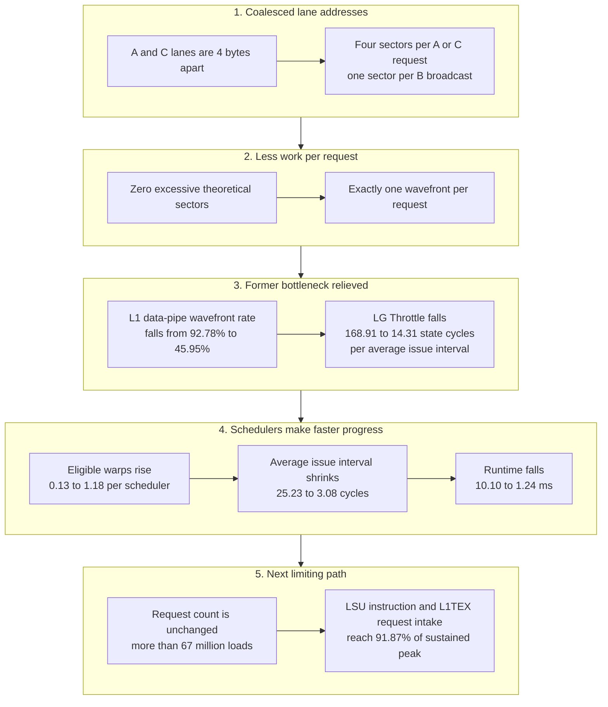

# 04 — Basic Coalesced GEMM

This case study analyzes the basic coalesced GEMM as the controlled follow-up to [03 — Basic Uncoalesced GEMM](03_basic_uncoalesced_gemm.md). For the profiled GPU kernel, the problem size, launch geometry, and arithmetic work are unchanged; the only performance-relevant change is the layout of `A` and `C`, which makes the addresses generated by each warp contiguous.

## Question

Do the NCU metrics change in the way predicted when the `A` and `C` accesses are coalesced, and what becomes the next bottleneck after the excessive sector and wavefront work is removed?

## Capture context

| Item | Value |
|---|---|
| Nsight Compute | 2023.2.0 |
| GPU | NVIDIA RTX A6000 |
| Compute capability | 8.6 |
| SM count | 84 |
| Collection | `--set full` |
| Replay passes | 34 |
| Kernel | `device_gemm` |
| Problem | `M=N=K=1024` |
| Grid | `(32,32,1)` = 1,024 blocks |
| Block | `(32,32,1)` = 1,024 threads/block |
| Total warps | 32,768 |
| Registers/thread | 40 |
| Measured duration | 1.236992 ms |

Relevant maintained source is in [04_basic_coalesced_gemm.cu](../04_basic_coalesced_gemm.cu):

- kernel and thread mapping: lines 69–81;
- problem dimensions: line 86;
- GPU layouts: lines 127–129;
- launch: lines 152–154.

## The controlled layout change

The thread mapping is unchanged:

```cpp
int m = blockIdx.x * blockDim.x + threadIdx.x;
int n = blockIdx.y * blockDim.y + threadIdx.y;
```

Because CUDA linearizes `threadIdx.x` first and `blockDim.x == 32`, one warp has a fixed `n` while its lanes cover 32 consecutive `m` values.

The GPU layouts are now:

```cpp
A: make_stride(1, M)
B: make_stride(1, K)
C: make_stride(1, M)
```

For `M=N=K=1024`, the float-element offsets are:

```text
A(m,k) = m + 1024*k
B(k,n) = k + 1024*n
C(m,n) = m + 1024*n
```

The only changes from the first kernel are the strides of `A` and `C`:

| Tensor | Non-coalesced layout | Coalesced layout | Effect across the lanes of one warp |
|---|---|---|---|
| `A` | `1024*m + k` | `m + 1024*k` | Lane distance changes from 4,096 bytes to 4 bytes. |
| `B` | `k + 1024*n` | unchanged | Every lane still reads the same address: a broadcast. |
| `C` | `1024*m + n` | `m + 1024*n` | Lane distance changes from 4,096 bytes to 4 bytes. |

The aligned device allocations, layout strides, problem dimensions, and launch dimensions make every `A` and `C` warp access begin on a 128-byte boundary. Therefore, the expected footprint of each request is:

| Access | Warp address pattern | Expected sectors/request | Expected wavefronts/request |
|---|---|---:|---:|
| `A(m,k)` load | 32 adjacent `float` values | 4 | 1 |
| `B(k,n)` load | one address broadcast to all lanes | 1 | 1 |
| `C(m,n)` load | 32 adjacent `float` values | 4 | 1 |
| `C(m,n)` store | 32 adjacent `float` values | 4 | 1 |

The 32 adjacent floats occupy 128 bytes: one 128-byte cache line made of four 32-byte sectors. On this GPU, one L1TEX wavefront can process those four sectors together for this aligned access.

## Predictions before reading the report

Because the kernel executes the same instructions for the same number of warps and loop iterations:

1. The number of global load and store **requests should not change**.
2. The number of sectors per `A` and `C` request should fall from 32 to 4.
3. The theoretical and ideal sector counts should become equal, leaving zero excessive sectors.
4. Every global request should now require one L1TEX wavefront; previously, the scattered `A` and `C` requests required several.
5. L1TEX data-pipe pressure and LG Throttle should fall, allowing the schedulers to issue more frequently.
6. Occupancy should remain almost unchanged because block size and register use are unchanged.

The report confirms all six predictions.

## Reconstructing the request counts

**Where in the report:** open **Details → Memory Workload Analysis Tables → L1/TEX Cache**. Read the **Requests** column for **Global Loads** and **Global Stores**.

As in the first case study, these metrics count warp-level global-memory operations entering L1TEX:

- **Global Load Requests:** `l1tex__t_requests_pipe_lsu_mem_global_op_ld.sum`
- **Global Store Requests:** `l1tex__t_requests_pipe_lsu_mem_global_op_st.sum`

There are:

```text
1,048,576 threads / 32 threads per warp = 32,768 warps
```

Each warp executes two global loads in each of 1,024 loop iterations, followed by one `C` load and one `C` store:

```text
loop load requests = 32,768 warps × 1,024 iterations × 2 = 67,108,864
C load requests    = 32,768 warps × 1                 =     32,768
global load total                                             67,141,632

global store requests = 32,768 warps × 1 = 32,768
```

**Observation:** the report contains exactly 67,141,632 global-load requests and 32,768 global-store requests—the same counts as the non-coalesced kernel. Coalescing changes how much sector and wavefront work each request creates; it does not remove any memory instructions from this kernel.

## Reconstructing the theoretical sectors

**Where in the report:** open **Details → Source Counters** for the rule summary. On the **Raw** page, search for the full metric names below. The **Source** page attributes the counts to source lines 76 and 78.

The relevant metrics are:

- `memory_l2_theoretical_sectors_global`: NCU's computed sector footprint for the actual lane addresses;
- `memory_l2_theoretical_sectors_global_ideal`: the computed sector footprint if each operation were coalesced as efficiently as possible;
- `derived__memory_l2_theoretical_sectors_global_excessive`: actual computed footprint minus ideal computed footprint.

### Dot-product line

The expression on source line 76 performs one four-sector `A` load and one one-sector `B` broadcast in each warp iteration:

```text
32,768 warps × 1,024 iterations × (4 A sectors + 1 B sector)
= 167,772,160 sectors
```

This is already the ideal footprint for those operations, so both theoretical and ideal counts are 167,772,160.

### Final C line

The expression on source line 78 performs one four-sector `C` load and one four-sector `C` store:

```text
32,768 warps × (4 load sectors + 4 store sectors)
= 262,144 sectors
```

This is also the ideal footprint.

### Whole-kernel result

```text
theoretical global sectors = 167,772,160 + 262,144 = 168,034,304
ideal global sectors       = 167,772,160 + 262,144 = 168,034,304
excessive sectors          =                               0
```

**Observation:** the report contains exactly these values. `derived__memory_l2_theoretical_sectors_global_excessive` is zero, so NCU emits no uncoalesced-global-access warning.

## Requests, sectors, and wavefronts in the measured L1 table

**Where in the report:** open **Details → Memory Workload Analysis Tables → L1/TEX Cache**. The table directly reports requests, sectors, wavefronts, sectors/request, and wavefronts/request.

| Operation | Requests | Sectors | Sectors/request | Wavefronts | Wavefronts/request |
|---|---:|---:|---:|---:|---:|
| Global loads | 67,141,632 | 167,903,232 | 2.5007 | 67,141,632 | 1.0000 |
| Global stores | 32,768 | 131,072 | 4.0000 | 32,768 | 1.0000 |

The load average combines two very different requests:

```text
repeated loop average = (4 A sectors + 1 B sector) / 2 requests
                      = 2.5 sectors/request
```

The one final four-sector `C` load per warp raises the whole-kernel value slightly to 2.5007. This is not partial coalescing: the `A` and `C` loads are fully coalesced, while the intentional `B` broadcast requires only one sector.

Most importantly, every request now creates exactly one wavefront. The first kernel required 4.502 wavefronts per load request and 8.004 per store request. Coalescing has therefore removed the internal wavefront multiplication that overloaded the L1TEX LSU data path.

## What “throughput” means in this report

A throughput percentage says how close a particular hardware component came to its sustainable peak rate for the kind of work that component performs. A compound throughput metric reports its largest peak-normalized constituent.

The coalesced report has two identical 91.87% SOL headlines, but they do not mean that FP32 arithmetic and DRAM bandwidth are both 91.87% utilized:

- **Memory Throughput = 91.87%** is driven by **L1: LSUIN Requests = 91.87%**, the rate at which requests enter the L1TEX LSU path.
- **Compute (SM) Throughput = 91.87%** is driven by **SM: Inst Executed Pipe LSU = 91.87%**, the rate at which LSU instructions execute on the SM side.
- **L1: Data Pipe LSU Wavefronts = 45.95%**, so the data-wavefront path that limited the first kernel is no longer near its peak.
- **L2 Cache Throughput = 10.93%** and **DRAM Throughput = 1.76%**, so neither downstream level is saturated.

The two 91.87% values describe the same high-rate stream at adjacent stages: warps execute LSU instructions, and the resulting requests enter L1TEX. Together they identify the SM-LSU-to-L1TEX request path as the limiting path; they do not identify two unrelated bottlenecks. The equal percentages alone do not establish which of the two adjacent capacities is encountered first.

During L1TEX-active cycles, LSUIN requests were processed at 98.15% of the sustainable peak LSUIN request rate. L1TEX was active for about 93.61% of its elapsed cycles, so expressing that request-processing rate over all L1TEX elapsed cycles gives:

```text
98.146% = 100 × (LSUIN requests / active cycles)
                  / (peak LSUIN requests / cycle)

93.607% = 100 × active cycles / elapsed cycles

100 × (LSUIN requests / elapsed cycles)
      / (peak LSUIN requests / cycle)
= 98.146% × 0.93607
≈ 91.872%
```

This gives the reported 91.87% elapsed-cycle LSUIN request rate, which drives the Memory Throughput headline.

## Key observations

### Runtime and throughput

**Where in the report:** find the headline values in **Details → GPU Speed Of Light Throughput**. Expand **GPU Throughput Breakdown → Compute Throughput Breakdown** and **Memory Throughput Breakdown** to identify the constituent responsible for each headline.

| UI label | Raw metric | Value | What it measures | Observation for this kernel |
|---|---|---:|---|---|
| Duration | `gpu__time_duration.sum` | 1.236992 ms | The measured execution duration of this profiled kernel instance. | The kernel is 8.16× faster than the non-coalesced version's 10.097536 ms. |
| Memory Throughput | `gpu__compute_memory_throughput.avg.pct_of_peak_sustained_elapsed` | 91.87% | The largest peak-normalized rate among selected memory-hierarchy constituents over elapsed cycles. | The breakdown shows that the value comes from L1TEX request intake, not data-wave processing, L2, or DRAM. |
| L1: LSUIN Requests | `l1tex__lsuin_requests.avg.pct_of_peak_sustained_elapsed` | 91.87% | The rate at which requests enter the L1TEX LSU path, relative to its sustained peak over elapsed cycles. | The request count did not fall, but the much shorter runtime means those requests now arrive at nearly the maximum sustained rate. This is the current limiting memory-side path. |
| L1: Data Pipe LSU Wavefronts | `l1tex__data_pipe_lsu_wavefronts.avg.pct_of_peak_sustained_elapsed` | 45.95% | The rate at which the L1TEX LSU data pipe processes wavefront work packages. | One wavefront per request leaves this path at less than half peak. It no longer drives the Memory Throughput headline. |
| Compute (SM) Throughput | `sm__throughput.avg.pct_of_peak_sustained_elapsed` | 91.87% | The largest peak-normalized rate among selected SM execution pipelines over elapsed cycles. | The breakdown identifies **SM: Inst Executed Pipe LSU**, not an arithmetic pipeline, as the 91.87% constituent. |
| L2 Cache Throughput | `lts__throughput.avg.pct_of_peak_sustained_elapsed` | 10.93% | The largest peak-normalized rate among selected L2 paths over elapsed cycles. | L2 does more work per unit time than in the slow kernel, but it remains far below its sustained peak. |
| DRAM Throughput | `gpu__dram_throughput.avg.pct_of_peak_sustained_elapsed` | 1.76% | The largest peak-normalized rate among selected DRAM constituents over elapsed cycles. | Measured DRAM bandwidth is only 12.83 GB/s, so this is not a DRAM-bandwidth-bound kernel. |

Coalescing did not make the memory system unimportant. It changed **which memory work is expensive**: the kernel is no longer limited by multiple data wavefronts per request, but it still executes more than 67 million load requests, and their request/instruction rate now approaches the capacity of the LSU request path.

### Cache behavior

**Where in the report:** find hit rates under **Details → Memory Workload Analysis** and the request/sector counts under **Memory Workload Analysis Tables**.

#### Requests, sectors, hits, and misses are local to each cache level

Each cache table describes the traffic that actually arrives at that cache level:

```text
sectors/request at cache level X
= sector accesses arriving at X / requests arriving at X

hit rate at cache level X
= sector accesses that hit in X / all sector accesses arriving at X
```

A **sector hit** means that the requested 32-byte sector is found at that cache level: its cache-line tag and sector data are present. A **sector miss** means that the requested sector is not found there.

The two cache tables have different input streams:

- **L1/TEX table:** its requests are the warp-level memory requests that arrive at L1TEX. Its sectors are the sectors those requests access in L1TEX.
- **L2 table:** its requests are only the requests that actually arrive at L2. Its sectors are only the sectors accessed by those L2 requests. The L2 table does not divide L2 sectors by the original number of L1 requests.

#### How L1 load misses become L2 requests

For a load, L1 first checks every sector required by the warp-level L1 request. Sectors that hit are served by L1. The missed sectors are grouped by their 128-byte cache-line address to create the requests sent toward L2:

```text
one warp-level L1 load request
        ↓
check all requested 32-byte sectors in L1
        ↓
keep only the sectors that miss
        ↓
group the missed sectors by 128-byte cache line
        ↓
one L2 request for each cache-line group
```

Each resulting L2 request targets exactly one 128-byte cache line and requests between one and four of that line's 32-byte sectors. Therefore, for one L1 load request:

- if all sectors hit in L1, it produces no L2 request;
- if one or more sectors miss within one cache line, it produces one L2 request;
- if missed sectors occupy `N` distinct cache lines, they conceptually produce `N` L2 requests.

The number depends on distinct cache lines, not simply on the number of missed sectors divided by four. For example, two missed sectors in two distant cache lines require two L2 requests, while four missed sectors in one cache line require only one. Missed sectors from different L1 load requests may also be combined into one L2 request when the requests are compatible, overlap suitably in time, and target the same 128-byte cache line. Requests targeting different cache lines cannot be combined, and NCU counts the requests that actually enter L2 after any such coalescing.

In this coalesced kernel, every individual `A`, `B`, or `C` load request has a footprint within one 128-byte cache line. An L1 load request can therefore produce either zero L2 requests when fully satisfied by L1 or at most one L2 request when any of its sectors miss. This is why the L2 load-request count can be viewed here as the downstream requests created from L1 load requests that were not fully satisfied, while still remaining a separate L2-level count.

The measured load counts demonstrate this level-local accounting:

```text
L1 global-load requests = 67,141,632
L1 global-load sectors  = 167,903,232
L1 sectors/request      = 167,903,232 / 67,141,632
                        = 2.5007

L1 load sectors that miss and reach L2 = 8,519,680

L2 load requests = 5,275,648
L2 load sectors  = 8,519,680
L2 sectors/request
= sectors accessed by requests arriving at L2
  / requests arriving at L2
= 8,519,680 / 5,275,648
= 1.6149
```

Thus, `1.6149` does not mean “L2 sectors divided by all 67,141,632 original L1 load requests.” It means that the load requests which actually reached L2 accessed about 1.6 sectors per L2 request. L1 hits reduce the total amount of L2 load traffic, but they do not necessarily reduce the L2 `Sectors/Req` ratio because both the L2 sector count and L2 request count are calculated only from the remaining traffic.

#### Store hits do not stop the write at L1

The load filtering model should not be applied directly to global stores. An L1 store hit means that the store's sector lookup hit in L1; it does not mean that the global write is complete and can stop there. L2 is the coherent cache level for global memory, so the write still proceeds to L2.

This report shows that behavior exactly:

```text
L1 global-store requests     =  32,768
L1 global-store sectors      = 131,072
L1 store sector hits         = 131,072  (100%)
L1-to-L2 store-write sectors = 131,072

L2 store requests            =  32,768
L2 store sectors             = 131,072
L2 store sector hits         = 131,072  (100%)
```

The same coalesced store therefore has four sectors/request at both levels:

```text
L1 store sectors/request = 131,072 / 32,768 = 4
L2 store sectors/request = 131,072 / 32,768 = 4
```

The two 100% hit rates describe two distinct lookups. The L1 hit says that the requested store sectors were present in L1. The write still reached L2, where the L2 hit says that those sectors were also present in L2 when the write arrived. It does not mean that L2 fetched the data a second time. The immediately preceding `C(m,n)` load naturally makes the sectors resident before the `C(m,n)` store. An L2 store hit also does not guarantee that the updated data never reaches DRAM; a dirty L2 line can be written back later.

#### Reading the reported hit rates

| UI label | Value | Interpretation |
|---|---:|---|
| L1/TEX Hit Rate | 94.93% | Of all sector accesses arriving at L1TEX, 94.93% found the requested sector in L1TEX. |
| L2 Hit Rate | 95.46% | Of all sector accesses arriving at L2, 95.46% found the requested sector in L2. This percentage is computed only from L2 traffic. |
| L2 Global Loads — Sectors/Request | 1.6149 | The load requests arriving at L2 accessed about 1.6 sectors per L2 request. Both numerator and denominator belong to the L2 request stream. |

The L1 hit rate falls from 99.20% to 94.93% even though the kernel becomes much faster. There is no contradiction:

- **Coalescing** asks how many sectors a warp operation needs for its lane addresses.
- **Hit rate** asks how many of the sector accesses arriving at a particular cache level find their data there.
- **Runtime** depends on the resulting work and bottleneck, not on hit rate alone.

## Scheduler and warp metrics

The definitions and normalization are developed step by step in the [Scheduler and warp stalls section of the first case study](03_basic_uncoalesced_gemm.md#scheduler-and-warp-stalls). Here we apply the same mental model to the coalesced report.

### Scheduler metrics

**Where in the report:** open **Details → Scheduler Statistics**.

| UI label | Raw metric | Value | Interpretation |
|---|---|---:|---|
| Active Warps Per Scheduler | `smsp__warps_active.avg.per_cycle_active` | 7.91 | On an average scheduler-active cycle, each scheduler has 7.91 resident, unfinished warps. |
| Eligible Warps Per Scheduler | `smsp__warps_eligible.avg.per_cycle_active` | 1.18 | On an average scheduler-active cycle, 1.18 warps have a next instruction that is ready to issue. This includes cycles with zero eligible warps. |
| Issued Warp Per Scheduler | `smsp__issue_active.avg.per_cycle_active` | ≈0.3246 | From the unrounded 32.463925% issue-active value, each scheduler issues on about 32.46% of its active cycles: once every 3.08 cycles on average. The UI displays this row as 0.32. |
| One or More Eligible | `smsp__issue_active.avg.pct_of_peak_sustained_active` | 32.46% | The fraction of scheduler-active cycles on which at least one warp is eligible and one warp issues. |
| No Eligible | `smsp__issue_inst0.avg.pct_of_peak_sustained_active` | 67.54% | The fraction of scheduler-active cycles on which no warp is eligible, so the scheduler cannot issue. |

The scheduler still spends many cycles without an eligible warp, primarily because of LSU/L1TEX request-queue backpressure, with smaller dependency and dispatch waits. However, coalescing raises eligible warps from 0.13 to 1.18 and shortens the average issue interval from 25.23 cycles to 3.08 cycles.

### Warp metrics

**Where in the report:** open **Details → Warp State Statistics → Warp State (All Cycles)**.

On every scheduler-active cycle, each active warp contributes one counted cycle to its current state. NCU accumulates those counts separately for states such as **LG Throttle**, **Long Scoreboard**, **Selected**, and **Not Selected**, then divides each state total by the number of issue-active scheduler cycles. The chart values therefore describe the distribution of active-warp states during an average issue interval.

Using the unrounded scheduler values:

```text
X = 1 / 0.32463925
  = 3.080342 scheduler-active cycles per average issue interval

W = 7.911369 active warps per scheduler-active cycle

N = X × W
  = 24.369724 state cycles per average issue interval
  ≈ 24.369723 reported by NCU
```

| UI label | Raw metric | Value | How to read it between consecutive issue-active cycles |
|---|---|---:|---|
| Warp Cycles Per Issued Instruction | `smsp__average_warp_latency_per_inst_issued.ratio` | 24.37 | Between two consecutive issue-active cycles, active warps contribute an average of 24.37 cycles across all warp states. |
| Stall LG Throttle | `smsp__average_warps_issue_stalled_lg_throttle_per_issue_active.ratio` | 14.31 | Between two consecutive issue-active cycles, active warps contribute an average of 14.31 cycles while their next local/global instruction cannot enter the full L1 instruction queue. This is 58.7% of all state cycles in the interval. |
| Stall Not Selected | `smsp__average_warps_issue_stalled_not_selected_per_issue_active.ratio` | 2.63 | Between two consecutive issue-active cycles, eligible warps contribute an average of 2.63 cycles while ready but not chosen because another warp issues. |
| Stall Long Scoreboard | `smsp__average_warps_issue_stalled_long_scoreboard_per_issue_active.ratio` | 2.31 | Between two consecutive issue-active cycles, active warps contribute an average of 2.31 cycles while waiting for the result of an earlier L1TEX operation. |
| Stall Wait | `smsp__average_warps_issue_stalled_wait_per_issue_active.ratio` | 2.02 | Between two consecutive issue-active cycles, active warps contribute an average of 2.02 cycles in the generic fixed-latency wait state reported by NCU. |
| Stall Dispatch Stall | `smsp__average_warps_issue_stalled_dispatch_stall_per_issue_active.ratio` | 1.87 | Between two consecutive issue-active cycles, active warps contribute an average of 1.87 cycles while the required dispatch path cannot accept their otherwise issuable instruction. |
| Selected | `smsp__average_warps_issue_stalled_selected_per_issue_active.ratio` | 1.00 | Between two consecutive issue-active cycles, one warp contributes one Selected cycle on the issue-active cycle associated with the average interval. |

LG Throttle remains the largest single state because the kernel now produces LSU requests at a very high rate. Its absolute normalized contribution nevertheless falls from 168.91 to 14.31 cycles per average issue interval. The remaining 14.31 does not show that coalescing failed; it shows that after removing wavefront amplification, request-queue pressure becomes the next limit.

The scheduler has `1.179569` eligible warps per scheduler-active cycle on average and issues on `0.32463925` of those cycles. A cycle with no issue has no eligible warp; otherwise, the scheduler would issue. Dividing therefore gives the average number of eligible warps specifically on an issue-active cycle:

```text
eligible warps per issue-active cycle
= (1.179569 eligible warps / [scheduler-active cycle])
  × ([scheduler-active cycle] / 0.32463925 issue-active cycles)

= (1.179569 / 0.32463925) eligible warps / issue-active cycle
= 3.6335 eligible warps / issue-active cycle

3.6335 eligible warps
≈ 1.0000 Selected + 2.6334 Not Selected
```

Thus, whenever an issue occurs, about 3.63 warps are eligible on average: one is selected, while the other 2.63 are ready but **Not Selected**.

## Occupancy

**Where in the report:** open **Details → Occupancy**.

| UI label | Raw metric | Value | Observation |
|---|---|---:|---|
| Theoretical Occupancy | `sm__maximum_warps_per_active_cycle_pct` | 66.67% | The 1,024-thread block and 40 registers/thread allow one 32-warp CTA per SM: 32 of the architectural maximum 48 warps. |
| Achieved Occupancy | `sm__warps_active.avg.pct_of_peak_sustained_active` | 65.86% | NCU measures 31.62 active warps per SM on average, very close to the allowed 32. |

Occupancy is effectively unchanged from the non-coalesced kernel because coalescing changes addresses, not launch geometry or resource requirements. The near-equality of theoretical and achieved occupancy also provides no evidence of a meaningful residency imbalance. The speedup comes from making the resident warps progress more efficiently, not from making more warps resident.

## Direct comparison with the non-coalesced kernel

| Metric | Non-coalesced | Coalesced | Change and meaning |
|---|---:|---:|---|
| Duration | 10.097536 ms | 1.236992 ms | **8.16× faster** |
| Global load requests | 67,141,632 | 67,141,632 | Unchanged: the same warp load instructions execute. |
| Global store requests | 32,768 | 32,768 | Unchanged: the same warp store instructions execute. |
| Theoretical global sectors | 1,109,393,408 | 168,034,304 | **6.60× fewer** sectors of computed address footprint |
| Excessive theoretical sectors | 941,359,104 | 0 | The address footprint is now ideal. |
| L1TEX load sectors/request | 16.508 | 2.5007 | At L1TEX, the mix is now four-sector `A`/`C` accesses plus one-sector `B` broadcasts. |
| L1TEX store sectors/request | 32.000 | 4.000 | At L1TEX, each `C` store now touches one aligned 128-byte line. |
| Load wavefronts/request | 4.502 | 1.000 | No multi-wavefront processing per load request remains. |
| Store wavefronts/request | 8.004 | 1.000 | No multi-wavefront processing per store request remains. |
| L1 data-pipe wavefront throughput | 92.78% | 45.95% | The former limiting L1TEX work path is relieved. |
| L1 LSUIN request throughput | 11.25% | 91.87% | The unchanged requests are processed much faster and now approach intake capacity. |
| Eligible warps/scheduler | 0.13 | 1.18 | Schedulers have many more ready warps. |
| Average issue interval | 25.23 cycles | 3.08 cycles | Issue events are **8.19× closer together**. |
| Total state cycles/issue interval | 198.87 | 24.37 | Active warps accumulate **8.16× fewer** state cycles between issue events. |
| LG Throttle/issue interval | 168.91 | 14.31 | Queue-backpressure contribution falls by about **11.8×**. |
| Achieved occupancy | 65.68% | 65.86% | Essentially unchanged, as predicted. |
| L1 hit rate | 99.20% | 94.93% | Lower hit rate does not prevent a large speedup; hit rate is not coalescing efficiency. |

This comparison isolates the cause of the speedup. The kernel does not launch more warps, execute fewer global-memory instructions, or obtain higher occupancy. It makes each `A` and `C` request cheaper by reducing its sector footprint and eliminating extra wavefronts; the `B` request was already an ideal one-sector broadcast.

## Causal interpretation



Read the diagram as one evidence chain:

1. Consecutive lanes now access consecutive `A` and `C` elements, giving each operation its ideal four-sector footprint. The `B` access remains an ideal one-sector broadcast.
2. The report confirms zero excessive sectors and one wavefront for every request. This removes the extra L1TEX data-pipe work created by the original scattered accesses.
3. L1 data-wavefront throughput falls to 45.95%, and the LG-throttle contribution between issue events falls sharply. These measurements show that the original bottleneck was relieved.
4. More resident warps are eligible, the schedulers issue much more often, and runtime improves by 8.16× even though occupancy is unchanged.
5. The kernel still performs the same very large number of warp-level global-load instructions. At the higher execution rate, the SM LSU instruction path and L1TEX request-input path both reach 91.87% of sustained peak. This request stream is the next bottleneck.

The report therefore supports this diagnosis:

> Coalescing fixes the excessive sector and wavefront work and produces the expected large speedup. The kernel is now limited primarily by the rate of LSU instructions and L1TEX requests, not by L1 data-wavefront processing, L2 throughput, or DRAM bandwidth.

## Next step

Coalescing has made each global-memory request efficient, but it has not reduced how many requests the naive GEMM executes. For example, the 32 warps in a CTA currently reload the same `A` values for their different `n` outputs. A shared-memory tile can load those values cooperatively and reuse them across the CTA. For `B`, cooperative loading along its contiguous `k` dimension can combine many separate one-value broadcast requests into fewer coalesced requests and stage the values for the CTA. Register blocking can then reuse tile values for several accumulators per thread.

The next experiment should therefore add shared-memory tiling and then register blocking. This should reduce the number of global load instructions and L1TEX requests, relieving the new LSU request-rate bottleneck, although synchronization and shared-memory work become new costs that the next report must measure.
