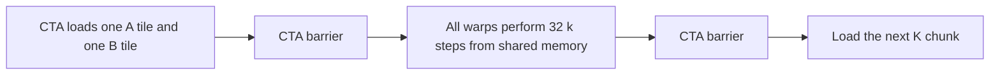
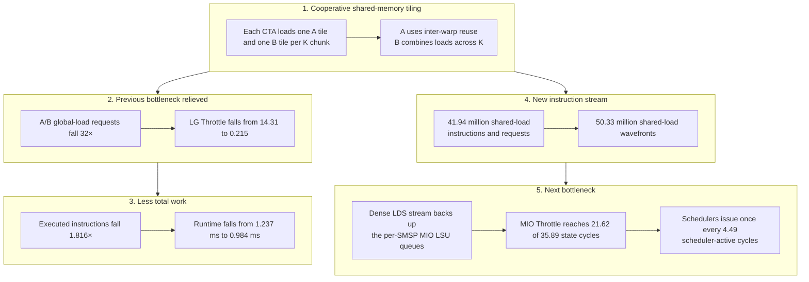

# 05 — Shared-Memory-Tiled GEMM

This case study analyzes the shared-memory-tiled GEMM capture as the next step after [04 — Basic Coalesced GEMM](04_basic_coalesced_gemm.md). The previous kernel made every global request efficient, but each warp still loaded its own `A` and `B` values directly from global memory. This version loads a `32 × 32` tile of each input cooperatively into shared memory and reuses those values across the CTA.

The report shows the intended result: the repeated global-load stream and its LG Throttle bottleneck are relieved. It also exposes the next limit: every FMA still has two logical shared-memory operands, producing a dense stream of scalar and vector `LDS` instructions and dominant MIO Throttle.

The queue and pipeline discussion below uses a practical performance model for Ampere GA10x GPUs. It keeps scheduler issue/enqueue, MIOC dispatch, and downstream completion separate. Exact queue capacities and arbitration details are not public architectural guarantees, so the measured NCU counters and source-correlated SASS remain the basis for the conclusions.

## Question

Does shared-memory tiling reduce the global request count as predicted, and what becomes the next bottleneck after the previous global/local admission pressure and LG Throttle are relieved?

## Capture context

| Item | Value |
|---|---|
| Nsight Compute | 2023.2.0 |
| GPU | NVIDIA RTX A6000 |
| Compute capability | 8.6 |
| SM count | 84 |
| Collection | `--set full`, with source correlation |
| Replay passes | 34 |
| Kernel | `gpu_gemm` |
| Problem | `M=N=K=1024` |
| Tile | `BLK_M=BLK_N=BLK_K=32` |
| Grid | `(32,32,1)` = 1,024 CTAs |
| Block | `(32,32,1)` = 1,024 threads/CTA |
| Total warps | 32,768 |
| Registers/thread | 37 |
| Static shared memory | 8,192 bytes/CTA |
| Total shared allocation | 9,216 bytes/CTA, including 1,024 driver bytes |
| Shared-memory configuration size | 16,384 bytes/SM for this capture |
| Measured duration | 983.680 μs |

Relevant maintained source is in [05_smem_tiled_gemm.cu](../05_smem_tiled_gemm.cu):

- kernel and thread mapping: lines 67–79;
- shared-memory tiles and layouts: lines 81–91;
- cooperative tile loads: lines 108–145;
- synchronization and shared-memory dot product: lines 147–158;
- final `C` access: lines 161–163;
- problem and tile dimensions: lines 173 and 236;
- launch: lines 237–242.

## The controlled algorithmic change

The coalesced kernel computed one output per thread and loaded both operands directly from global memory for all 1,024 values of `k`. The tiled kernel still computes one output per thread, but divides `K` into 32 chunks:

```text
K / BLK_K = 1,024 / 32 = 32 K chunks
```

For each chunk, the 1,024 threads in a CTA cooperatively load:

```text
one 32 × 32 A tile = 1,024 values
one 32 × 32 B tile = 1,024 values
```

The thread mapping is important: each warp has a fixed `ly`, and therefore a fixed output column `n`, while its 32 lanes use `lx=0..31` to compute 32 different output rows `m`.

### Before tiling: direct global loads

For each value of `k`, using `m` and `n` coordinates local to the CTA's output tile:

| Operand | Within one warp (`n` fixed, lanes span 32 rows `m`) | Across the 32 warps (warps span 32 columns `n`) |
|---|---|---|
| `A(m,k)` | At the current `k`, the 32 lanes load `A(m=0..31,k)`: 32 adjacent values for their 32 output rows. This produces one coalesced four-sector request. | For the same logical `k` iteration, all warps need the same 32 `A` values. Because `A(m,k)` does not depend on output column `n`, all 32 warps issue overlapping requests for the same global-memory data. |
| `B(k,n)` | At the current `k`, every lane in the warp loads the same `B(k,n)` value for the warp's output column. This produces a one-sector request whose value is broadcast to all 32 lanes. | Each warp computes a different output column `n`, so the 32 warps request 32 different `B(k,n)` values. These requests do not overlap, and cross-warp reuse is not needed. |

Over the 32 `k` values in one chunk, each warp consequently issues 32 `A` requests and 32 `B` requests, for 64 global-load requests.

### After tiling: cooperative loading and shared-memory reuse

For each K chunk, the CTA cooperatively loads the complete corresponding `A` and `B` tiles into shared memory, with each thread loading one `A` element and one `B` element. Using coordinates local to the current tiles:

| Operand tile | Within one warp (`ly` fixed, `lx=0..31`) | Across the 32 warps (`ly=0..31`) |
|---|---|---|
| `A(m,k)` | Warp `ly` loads the 32 adjacent values `A(m=0..31, k=ly)`: all rows for one `k`. | Different warps load different `k` slices. Together they cover the complete `32 × 32` A tile, with no element loaded by more than one warp. |
| `B(k,n)` | Warp `ly` loads the 32 adjacent values `B(k=0..31, n=ly)`: all `k` values for one column `n`. | Different warps load different `n` columns. Together they cover the complete `32 × 32` B tile, with no element loaded by more than one warp. |

Each warp therefore issues one `A` and one `B` global-load request per K chunk. Across the CTA, those requests partition both tiles without overlapping global-memory loads.



The first barrier waits until both tiles are ready for use. The second prevents the next K chunk from overwriting them before every warp has finished the current chunk.

During the dot product, the threads use the same logical access pattern as the basic coalesced kernel. For each `k`, a warp still needs 32 different `A` values and one `B` value broadcast to all lanes. The difference is that these values are now fetched from the shared-memory tiles rather than directly from global memory.

| Operand | Within one warp at a fixed `k` | Across the 32 warps in the CTA | What shared memory changes |
|---|---|---|---|
| `A(m,k)` | Lane `lx` reads `A(m=lx,k)`, so the 32 lanes read 32 different adjacent values for their different output rows. | The warps compute different output columns `n` but need the same 32-value `A` slice. | The CTA loads that slice from global memory once, after which all 32 warps read it from shared memory. |
| `B(k,n)` | Every lane reads the same `B(k,n)` value for the warp's output column, so shared memory broadcasts it to all 32 lanes. | Different warps compute different columns and therefore read different `B` values; cross-warp reuse is neither available nor needed. | Each `B` value is loaded from global memory once and then supplies the same within-warp broadcast that global memory supplied before. |

Tiling therefore does not change which operand values the FMA loop needs. It changes how they arrive: global memory supplies each tile cooperatively once, and shared memory serves the repeated accesses during the dot product. The `A` savings come from eliminating duplicate global loads across warps, while the `B` savings come from combining 32 separate requests across `k` into one cooperative four-sector request per warp.

## Predictions before reading the report

For this exact `32 × 32 × 32` tile:

1. For each K chunk, the cooperative tile-loading step should require only two global-load requests per warp—one for `A` and one for `B`—instead of the 64 direct global-load requests that the coalesced kernel issued while processing the same 32 `k` values. This is a 32× reduction.
2. The cooperative `A` and `B` requests should both be fully coalesced four-sector requests with one global L1TEX wavefront each.
3. The theoretical and ideal global-sector counts should remain equal, with zero excessive sectors.
4. LG Throttle should collapse because the kernel issues far fewer global-memory instructions.
5. Runtime should improve because the total executed instruction count should fall sharply, mainly because the repeated global-load instructions are drastically reduced.

The report confirms all five predictions.

## Reconstructing the global request counts

**Where in the report:** open **Details → Memory Workload Analysis Tables → L1/TEX Cache** and read the global-load and global-store request counts. For the global loads and stores in this kernel, each executed warp-level memory instruction produces one L1TEX request. The instruction totals in **Memory Workload Analysis Chart** therefore numerically match the request totals in **L1/TEX Cache**. They remain different counters: one counts executed warp instructions, while the other counts requests entering L1TEX.

The metrics are:

- `l1tex__t_requests_pipe_lsu_mem_global_op_ld.sum`;
- `l1tex__t_requests_pipe_lsu_mem_global_op_st.sum`.

There are 32 warps in each CTA, and every warp processes all 32 K chunks. The total number of times one warp processes one K chunk across the grid is:

```text
Q = 1,024 CTAs × 32 warps/CTA × 32 K chunks/warp
  = 1,048,576 warp-level K-chunk executions
```

Each time a warp processes one K chunk, the cooperative tile-loading code executes one `A` global load and one `B` global load:

```text
A/B cooperative tile-load requests = Q × 2
                                   = 2,097,152

final C load requests  = 32,768 warps × 1
                       =    32,768

total global loads     = 2,129,920
global stores          =    32,768
```

**Observation:** the report contains exactly 2,129,920 global-load requests and 32,768 global-store requests.

For the same 32 `k` values, the previous kernel issued 64 direct global-load requests per warp: 32 `A` loads and 32 `B` loads. Tiling reduces this to two cooperative requests per warp per K chunk:

```text
64 requests / 2 requests = 32× fewer A/B global-load requests per K chunk
```

Including the unchanged final `C` load, the whole-kernel global-load count falls from 67,141,632 to 2,129,920, a 31.52× reduction.

## Reconstructing the global sectors and wavefronts

**Where in the report:** open **Details → Source Counters** for the theoretical and ideal sector totals. Open **Memory Workload Analysis Tables → L1/TEX Cache** for the measured requests, sectors, and wavefronts.

The relevant source metrics are:

- `memory_l2_theoretical_sectors_global`;
- `memory_l2_theoretical_sectors_global_ideal`;
- `derived__memory_l2_theoretical_sectors_global_excessive`.

### Cooperative A and B accesses

Within a warp, `threadIdx.x` covers `0..31` while `threadIdx.y` is fixed. `A` is M-major, so the lanes vary its contiguous `m` coordinate while `k` remains fixed. `B` is K-major, so the lanes vary its contiguous `k` coordinate while `n` remains fixed. The cooperative loads therefore both access 32 adjacent floats:

```text
A tile load: A(m + lane, k)
B tile load: B(k + lane, n)
```

Each request covers 128 aligned bytes, or four 32-byte sectors, and requires one global L1TEX wavefront:

```text
cooperative A/B tile-load sectors = Q × (4 A sectors + 4 B sectors)
                                  = 8,388,608
```

The final `C` load and store each add four sectors per warp:

```text
C load sectors  = 32,768 × 4 = 131,072
C store sectors = 32,768 × 4 = 131,072
```

The whole-kernel prediction is therefore:

```text
global load sectors  = 8,388,608 + 131,072 = 8,519,680
global store sectors =                           131,072

theoretical sectors  =                         8,650,752
ideal sectors        =                         8,650,752
excessive sectors    =                                 0
```

The report matches every value.

### Measured L1TEX global traffic

| Operation | Requests | Sectors | Sectors/request | Wavefronts | Wavefronts/request |
|---|---:|---:|---:|---:|---:|
| Global loads | 2,129,920 | 8,519,680 | 4.000 | 2,129,920 | 1.000 |
| Global stores | 32,768 | 131,072 | 4.000 | 32,768 | 1.000 |

The total work tells the complete story:

| A/B global traffic | Basic coalesced | Shared-memory tiled | Reduction |
|---|---:|---:|---:|
| `A` requests | 33,554,432 | 1,048,576 | 32× |
| `A` sectors | 134,217,728 | 4,194,304 | 32× |
| `B` requests | 33,554,432 | 1,048,576 | 32× |
| `B` sectors | 33,554,432 | 4,194,304 | 8× |
| Combined requests | 67,108,864 | 2,097,152 | 32× |
| Combined sectors | 167,772,160 | 8,388,608 | 20× |

This illustrates how to read sectors/request: it describes the average footprint of one request, while total sectors describes the total sector work. The value rises from 2.5007 to 4.000 because the previous stream mixed four-sector `A` requests with many one-sector `B` broadcasts, whereas each cooperative `A` or `B` request now fetches 32 adjacent floats with its ideal four-sector footprint. At the same time, whole-kernel global-load requests fall by 31.52× and the combined `A`/`B` sector work falls by 20×, so the higher sectors/request value belongs to a much smaller, efficient request stream whose data is reused from shared memory.

## Shared-memory instructions, requests, and wavefronts

Shared memory is banked on-chip memory and does not use global memory's sector/cache-line coalescing model. Ampere shared memory has 32 banks, with consecutive 32-bit words mapping to consecutive banks and wrapping after bank 31:

```text
bank = (byte address / 4) mod 32

for float elements:
bank = element index mod 32
```

When several lanes read the same word, shared memory can broadcast that word without a bank conflict. A bank conflict occurs when lanes in one warp request different words from the same bank during the same service phase, forcing additional serialized service.

On this architecture, one executed warp-level shared-memory instruction creates one request. The instruction's per-thread access width influences how much ideal service work is required, while the warp-wide address-to-bank mapping determines whether additional conflict wavefronts are needed.

```text
one warp-level LDS/STS instruction
    -> one shared-memory request
    -> one or more wavefronts
       determined by per-thread width and warp-wide address-to-bank mapping
```

**Where in the report:** open **Details → Memory Workload Analysis Tables → Shared Memory** for instruction, request, and wavefront totals. In **Source**, the cooperative stores are associated with lines 125 and 144, while the dot-product `LDS` and `LDS.128` instructions are associated with line 153.

### Reconstructing the instruction and request counts

For the captured `32 × 32 × 32` tile, the helper loops that load each tile execute once. The relevant body of one K-chunk iteration is therefore equivalent to:

```cpp
for (int k_chunk = 0; k_chunk < num_k_chunks; ++k_chunk) {
    // One element per thread: global memory -> shared memory
    ATensorSmem(lx, ly) = gmemATensor(lx, ly);
    BTensorSmem(lx, ly) = gmemBTensor(lx, ly);

    __syncthreads();

    for (int k = 0; k < BLK_K; ++k) {
        dotProduct += ATensorSmem(lx, k) * BTensorSmem(k, ly);
    }

    __syncthreads();
}
```

`ATensorSmem` and `BTensorSmem` wrap the `__shared__` arrays, so the two assignments copy the warp's A and B values from global to shared memory. Each warp executes one `STS` for A and one for B per K chunk. These stores occur before the dot-product loop; `__syncthreads()` separately compiles to `BAR.SYNC`, not `STS`.

The 32-iteration dot-product loop has a compile-time size and is fully unrolled. For each warp and K chunk, its 32 logical A reads remain 32 scalar `LDS` instructions, while its 32 logical B reads are combined into 8 vector `LDS.128` instructions. The complete generated instruction structure is:

| K-chunk phase | Generated warp instructions |
|---|---|
| Copy A from global to shared memory | 1 global load + 1 `STS` |
| Copy B from global to shared memory | 1 global load + 1 `STS` |
| Wait for both tiles to be ready | 1 `BAR.SYNC` |
| Perform the 32-step dot product | 32 scalar A `LDS` + 8 vector B `LDS.128` + 32 `FFMA` |
| Wait before overwriting the tiles | 1 `BAR.SYNC` |

Only the `LDS`, `LDS.128`, and `STS` rows contribute to the shared-memory instruction and request totals below. `BAR.SYNC` and `FFMA` are separate instruction classes.

On this architecture, each executed warp-level shared-memory SASS instruction creates one shared-memory request. The shared instruction and request counts are therefore:

| Operation | Instructions per warp per K chunk | Total instructions | Total requests |
|---|---:|---:|---:|
| `A` shared loads | 32 scalar `LDS` | 33,554,432 | 33,554,432 |
| `B` shared loads | 8 vector `LDS.128` | 8,388,608 | 8,388,608 |
| Cooperative shared stores | 2 `STS` | 2,097,152 | 2,097,152 |

Equivalently:

```text
shared-load instructions and requests
= Q × (32 LDS + 8 LDS.128)
= 41,943,040

shared-store instructions and requests
= Q × 2 STS
= 2,097,152
```

The instruction totals exactly match:

- `smsp__sass_inst_executed_op_shared_ld.sum`;
- `smsp__sass_inst_executed_op_shared_st.sum`.

The `128` in `LDS.128` is the access width per participating thread: each lane loads four adjacent 32-bit `B` values. The warp still executes one `LDS.128` instruction and creates one request. The compiler has therefore reduced 32 scalar `B` loads to 8 vector loads per warp per K chunk.

### Why 40 load requests require 48 ideal wavefronts

The scalar `A` loads and vectorized `B` loads have different warp-wide address patterns.

For an `A` load at a fixed `k`:

```text
shared index = lx + 32 × k
bank         = (lx + 32 × k) mod 32
             = lx
```

The 32 lanes read different words from all 32 banks, so each scalar `LDS` requires one ideal wavefront.

For a `B` load, `ly` is fixed across the warp and the address does not depend on `lx`. Every lane requests the same four consecutive `B` values loaded by the `LDS.128`, so the reads use shared-memory broadcast rather than creating a bank conflict. In this GA102 report, each emitted `LDS.128` requires two ideal wavefronts. This is the measured service requirement for this vector instruction and address pattern, not a universal count for every `LDS.128`.

```text
32 scalar LDS × 1 ideal wavefront = 32 wavefronts
 8 LDS.128    × 2 ideal wavefronts = 16 wavefronts
                                         ──
shared-load total per warp per K chunk  48 wavefronts
```

The two shared stores have fixed `ly`, while their lanes write `lx + 32 × ly`: 32 adjacent words that map to 32 distinct banks. Each `STS` request therefore requires one ideal wavefront and no additional conflict wavefronts, so the source-attributed store request and wavefront counts are equal:

```text
2 STS requests × 1 wavefront/request
= 2 source-attributed shared-store wavefronts per warp per K chunk
```

Across the kernel:

```text
source-attributed shared-load wavefronts  = Q × 48 = 50,331,648
source-attributed shared-store wavefronts = Q × 2  =  2,097,152

total source-attributed shared wavefronts
= 52,428,800 actual
= 52,428,800 ideal
```

The totals are reported by `memory_l1_wavefronts_shared` and `memory_l1_wavefronts_shared_ideal` in **Source Counters**. NCU's ideal count already includes the service work inherently required by the instruction width, participating lanes, broadcasts, and address pattern. Excessive wavefronts are `actual - ideal`: additional serialized work beyond that baseline, commonly caused by bank conflicts. Here actual equals ideal and `derived__memory_l1_wavefronts_shared_excessive = 0`, so the accesses require no additional address-level conflict wavefronts. The two ideal wavefronts used by each `LDS.128` are required work, not conflict work.

### Resolving the aggregate shared-store warning

The aggregate Shared Memory table reports 615,081 shared-store bank conflicts, 2,712,226 store wavefronts, and an average 1.3-way conflict. That warning alone appears to indicate an address-layout problem, but the source-attributed evidence shows:

- one actual and one ideal wavefront at every `STS` site;
- 52,428,800 actual and 52,428,800 ideal shared wavefronts in total;
- zero `derived__memory_l1_wavefronts_shared_excessive`;
- zero SASS-attributed shared-store conflicts.

The store addresses independently confirm the source result. Each warp has fixed `ly` and `lx=0..31`, and both cooperative stores use:

```text
shared index = lx + 32 × ly
bank         = (lx + 32 × ly) mod 32
             = lx
```

The 32 lanes therefore write 32 distinct banks. The aggregate rule is not source-attributed and does not by itself establish that this address mapping required excessive wavefronts. To answer that question, compare the source-attributed actual and ideal counts: actual greater than ideal indicates additional serialized work, while equality indicates no excessive address-level conflict work.

**Conclusion:** the source metrics show no address-level shared-memory bank conflict. The next bottleneck comes from the volume of valid shared-memory instructions, requests, and wavefronts, not from an inefficient bank layout.

## What the SOL throughput values mean

**Where in the report:** open **Details → GPU Speed Of Light Throughput**, then expand **GPU Throughput Breakdown → Compute Throughput Breakdown** and **Memory Throughput Breakdown**.

| UI label | Raw metric | Value | Interpretation for this kernel |
|---|---|---:|---|
| Duration | `gpu__time_duration.sum` | 983.680 μs | Tiling reduces runtime from 1.236992 ms to 0.983680 ms: 20.48% less time, or a 1.2575× speedup. |
| Memory Throughput | `gpu__compute_memory_throughput.avg.pct_of_peak_sustained_elapsed` | 79.50% | This compound headline selects the highest peak-normalized memory constituent, which is **L1: LSUIN Requests** here. It does not mean that the kernel uses 79.50% of DRAM bandwidth. |
| L1: LSUIN Requests | `l1tex__lsuin_requests.avg.pct_of_peak_sustained_elapsed` | 79.50% | Across all elapsed L1TEX cycles, global- and shared-memory requests enter through LSUIN at 79.50% of its peak rate. Because shared operations dominate the request count, this high value primarily reflects the new shared load/store stream. |
| L1: Data Pipe LSU Wavefronts | `l1tex__data_pipe_lsu_wavefronts.avg.pct_of_peak_sustained_elapsed` | 47.67% | The LSU data pipe processes wavefronts at 47.67% of peak. Shared-memory wavefronts account for 45.68 percentage points, including 43.24 points from shared loads, so nearly all work on this pipe is shared-memory work. |
| Compute (SM) Throughput | `sm__throughput.avg.pct_of_peak_sustained_elapsed` | 79.50% | This compound SM headline is selected by **SM: Inst Executed Pipe LSU**. It does not mean that FP32 arithmetic executes at 79.50% of peak. |
| SM: Inst Executed Pipe LSU | `sm__inst_executed_pipe_lsu.avg.pct_of_peak_sustained_elapsed` | 79.50% | The SM-wide LSU pipe executes warp instructions at 79.50% of its peak rate over elapsed cycles. Shared loads and stores form about 95.3% of the global-plus-shared instruction stream, so this value mainly measures shared-memory instruction throughput. |
| FMA pipe cycles active | `sm__pipe_fma_cycles_active.avg.pct_of_peak_sustained_elapsed` | 7.75% | The FMA pipe is active at only 7.75% of peak, while the roofline reports about 7% of FP32 peak. Arithmetic throughput is therefore not the current limit; LSU work dominates. |
| L2 Cache Throughput | `lts__throughput.avg.pct_of_peak_sustained_elapsed` | 13.75% | L2 operates far below its peak throughput, so L2 bandwidth is not the bottleneck. |
| DRAM Throughput | `gpu__dram_throughput.avg.pct_of_peak_sustained_elapsed` | 2.21% | Off-chip memory traffic uses only 2.21% of peak DRAM throughput, ruling out DRAM bandwidth as the bottleneck. |

The identical 79.50% Compute and Memory headlines do not mean that FP32 compute and byte bandwidth are equally utilized. They come from adjacent stages of the same shared-heavy LSU path.

On Ampere, each SMSP scheduler first issues an LSU instruction into its own MIO LSU queue. MIOC then arbitrates among the per-SMSP queues and dispatches a selected warp-level instruction into the SM-wide LSU path, which feeds LSUIN and the unified L1TEX/shared-memory subsystem. On this GA10x path, MIOC can dispatch at most one selected LSU warp instruction per SM cycle. This is an issue/dispatch throughput limit, not a statement about how long an operation takes to complete:

```text
per-SMSP MIO LSU queue
    -> MIOC dispatch
    -> SM-wide LSU pipe
    -> LSUIN
    -> unified L1TEX/shared-memory subsystem
```

For this kernel's global- and shared-memory instructions, `sm__inst_executed_pipe_lsu` measures the warp instructions executed on the SM LSU side, while `l1tex__lsuin_requests` measures the corresponding requests entering the unified subsystem through LSUIN. The two compound headlines select those different counters from this same high-rate path.

The active-to-elapsed conversion is also visible in this report. L1TEX is active for 94.49% of its elapsed cycles:

```text
active fraction
= 109,985,288 active cycles / 116,395,752 elapsed cycles
= 94.4925%

84.1356% active-cycle LSUIN request rate × 94.4925% active fraction
= 79.5019% elapsed-cycle LSUIN request rate
```

In plain language, LSUIN processes requests at 84.14% of its peak rate while L1TEX is active, and at 79.50% of peak when the inactive elapsed cycles are also included.

## Cache behavior

**Where in the report:** open **Details → Memory Workload Analysis** for the headline hit rates and **Memory Workload Analysis Tables → L1/TEX Cache** and **L2 Cache** for the request, sector, hit, and miss counts.

### Demand fetching, prefetching, and locality

The cache behavior in this report can be understood with a demand-fetch model:

```text
current memory operation requests a sector
    ├── sector is present  → hit  → serve it from this cache
    └── sector is absent   → miss → request it from the next level
                                             ↓
                                      install returned data
                                             ↓
                         a later request may hit while it remains resident
```

L1 and L2 cache lines contain four separately tracked 32-byte sectors, for a total of 128 bytes. A request for one sector does not, by itself, demand the other three sectors in that line or an adjacent cache line. In this kernel, each aligned warp load requests all four sectors of one cache line, so the whole line is demanded by that request rather than brought in as adjacent-line prefetch.

The related concepts are distinct:

| Concept | Meaning here |
|---|---|
| Demand fetching | A requested sector that is absent is fetched from the next memory level. |
| Spatial locality and coalescing | The lanes of the current warp request nearby addresses that fit into few sectors and cache lines. Those sectors belong to the current request; they are not prefetched. |
| Temporal locality | A later warp or CTA requests the same sector and hits if it is still resident. |
| Prefetching or speculative fetching | Data is fetched before a memory operation demands it. This kernel issues no explicit prefetch, and no adjacent-line prefetch is needed to explain the measured hit rates. |

NCU reports hits and misses per requested sector. A cache-line tag can be present while a particular sector's data is absent; that sector access is still counted as a miss.

### L1TEX

| Operation | Requests reaching L1TEX | Sectors | Sectors/request | Sector hit rate |
|---|---:|---:|---:|---:|
| Global loads | 2,129,920 | 8,519,680 | 4.000 | 0% |
| Global stores | 32,768 | 131,072 | 4.000 | 100% |

All 8,519,680 global-load sectors miss L1 in this capture. The 131,072 store-sector hits therefore produce the overall 1.52% L1 hit rate:

```text
131,072 / (8,519,680 + 131,072) = 1.515%
```

The fall from the previous kernel's 94.93% L1 hit rate is not a regression. The previous kernel repeatedly issued loads and depended on L1 to satisfy most of them. Tiling avoids those repeated L1 operations entirely and performs the intra-CTA reuse explicitly from shared memory.

### L2

In this capture, every L1 load request is one aligned four-sector cache-line request and all four sectors miss. No downstream split or combination changes the count, so the L2 load table contains the same 2,129,920 requests and 8,519,680 sectors:

| Operation | Requests reaching L2 | Sectors reaching L2 | Sectors/request | Sector hits | Sector misses | Sector hit rate |
|---|---:|---:|---:|---:|---:|---:|
| Loads | 2,129,920 | 8,519,680 | 4.000 | 8,126,448 | 393,216 | 95.38% |
| Stores | 32,768 | 131,072 | 4.000 | 131,072 | 0 | 100% |

The 393,216 L2 load misses have a useful exact interpretation:

```text
one 1,024 × 1,024 float matrix
= 4,194,304 bytes / 32 bytes per sector
= 131,072 sectors

A + B + C unique sectors
= 3 × 131,072
= 393,216 L2 load misses

A + B + C unique 128-byte cache lines
= 393,216 sectors / 4 sectors per line
= 98,304 cache lines
```

Because each load request covers all four sectors of one aligned cache line, the measured behavior can be read as:

```text
first demand for an A, B, or C line from one of the CTAs
    → four L2 sector misses
    → fetch those sectors from DRAM and install them in L2

later demands for the same A or B line from other CTAs
    → four L2 sector hits while the line remains resident
```

NCU does not identify which warp or CTA made the first request. However, the equality between the unique footprint and the L2 miss count is consistent with one L2 miss for each unique sector in this capture. Later `A` and `B` requests from other CTAs then hit while those sectors remained resident. Each `C` line is loaded by its owning CTA rather than reused by other CTAs; its later global store accounts for the L2 store hits in the table.

The repeated `A` and `B` accesses demonstrate **temporal locality**, not prefetching: the later CTAs explicitly request the same sectors after an earlier demand has filled them.

The repeated tile loads made by different CTAs are therefore served almost entirely by L2. DRAM reads only about 12.58 MB, essentially one copy of the unique `A`, `B`, and `C` input sectors. The optimization removes redundant work above L2; it does not need a large reduction in compulsory DRAM traffic to improve runtime.

The basic coalesced kernel also sent 8,519,680 load sectors to L2, achieved a 95.46% L2 hit rate, and read about 12.59 MB from DRAM. Tiling changes the amount and location of reuse above L2: repeated L1 requests disappear, while the downstream sector traffic remains essentially unchanged.

## Scheduler and warp metrics

### Scheduler metrics

**Where in the report:** open **Details → Scheduler Statistics**.

| UI label | Raw metric | Value | Interpretation |
|---|---|---:|---|
| Issued Warp Per Scheduler | `smsp__issue_active.avg.per_cycle_active` | 0.2227 | On an average scheduler-active cycle, each scheduler issues 0.2227 warp instructions. Since at most one warp can be selected per cycle, this means an issue occurs on 22.27% of scheduler-active cycles. |
| One or More Eligible | `smsp__issue_active.avg.pct_of_peak_sustained_active` | 22.27% | At least one warp is eligible on 22.27% of scheduler-active cycles. On this GPU, the scheduler issues on those cycles. |
| No Eligible | `smsp__issue_inst0.avg.pct_of_peak_sustained_active` | 77.73% | No warp has a ready next instruction on 77.73% of scheduler-active cycles, so no instruction can be issued. |
| Active Warps Per Scheduler | `smsp__warps_active.avg.per_cycle_active` | 7.9928 | Nearly eight resident warps are active per scheduler on an average scheduler-active cycle. |
| Eligible Warps Per Scheduler | `smsp__warps_eligible.avg.per_cycle_active` | 1.0352 | Across all scheduler-active cycles, an average of only 1.035 warps per scheduler have a next instruction ready to issue. This average includes the 77.73% of cycles with no eligible warp. |

The issue rate gives the average-equivalent interval between two consecutive issue-active cycles:

```text
average issue interval
= 1 / 0.22268656
= 4.4906 scheduler-active cycles
```

With 7.9928 active warps per scheduler, those intervals contain:

```text
4.4906 cycles × 7.9928 active warps
= 35.8924 cycles counted across the active warps
```

This reproduces **Warp Cycles Per Issued Instruction**. It is an average-equivalent view, not a claim that every neighboring pair of issue events is exactly 4.4906 cycles apart.

The eligible-warp metrics also reconcile with Selected and Not Selected:

```text
eligible warps per issue-active cycle
= (1.035188 eligible warps / scheduler-active cycle)
  × (scheduler-active cycle / 0.22268656 issue-active cycles)

= 4.6486 eligible warps / issue-active cycle
≈ 1.0000 Selected + 3.6488 Not Selected
```

Whenever an issue occurs, about 4.65 warps are eligible on average. One is selected and the other 3.65 remain ready but Not Selected on that cycle.

### Warp metrics

The warp-state metrics explain why the resident warps are or are not eligible during the scheduler cycles summarized above.

#### Throttle and scoreboard states

Queue-admission stalls and dependency stalls refer to different points in an instruction's lifetime:

```text
Throttle:
    the warp's next instruction cannot be admitted

Scoreboard:
    an earlier producer was issued/enqueued, but its result is not ready
```

In the practical Ampere model, **LG Throttle** means the warp's next global/local instruction cannot enter its SMSP's MIO LSU queue because the earlier global/local admission watermark has been reached. **MIO Throttle** is broader: the warp's next MIO-managed instruction cannot enter its destination MIO queue because that queue is full. Source-correlated SASS identifies the stalled instruction class; that instruction's destination then identifies the relevant queue.

#### Warp states in this report

**Where in the report:** open **Details → Warp State Statistics → Warp State (All Cycles)**. For source attribution, open **Source** and select the warp-stall sampling metrics.

The average interval between two consecutive issue-active cycles spans 4.4906 scheduler-active cycles. With 7.9928 active warps per scheduler-active cycle, those warps collectively contribute 35.8924 state cycles during the interval. The complete Warp State chart partitions those state cycles among the different warp states.

Read every value below as an average across issue intervals. It is not elapsed scheduler time and does not mean that one warp remained in the state for that many consecutive cycles; several active warps can contribute a state cycle during the same scheduler cycle.

| State | Raw metric | State cycles per average issue interval | How to read it between consecutive issue-active cycles |
|---|---|---:|---|
| MIO Throttle | `smsp__average_warps_issue_stalled_mio_throttle_per_issue_active.ratio` | 21.620 | Between two consecutive issue-active cycles, active warps collectively contribute 21.620 cycles while their next MIO-managed instruction cannot enter a full destination MIO queue. This is 60.24% of all 35.8924 state cycles in the average interval. The source samples below show that almost all of this pressure comes from shared-memory loads waiting to enter the MIO LSU queue. |
| Long Scoreboard | `smsp__average_warps_issue_stalled_long_scoreboard_per_issue_active.ratio` | 4.387 | Between two consecutive issue-active cycles, active warps collectively contribute 4.387 cycles while their next instruction waits for the result of an earlier producer. Here this is mostly the shared `STS` waiting for the register produced by the preceding global tile load. |
| Not Selected | `smsp__average_warps_issue_stalled_not_selected_per_issue_active.ratio` | 3.649 | On the issue-active cycle associated with an average interval, about 3.649 additional eligible warps are ready to issue but are not chosen because one other warp is selected. |
| Barrier | `smsp__average_warps_issue_stalled_barrier_per_issue_active.ratio` | 2.383 | Between two consecutive issue-active cycles, active warps collectively contribute 2.383 cycles while waiting at the two CTA barriers used in each K chunk for the other warps in the CTA to arrive. |
| Wait | `smsp__average_warps_issue_stalled_wait_per_issue_active.ratio` | 1.723 | Between two consecutive issue-active cycles, active warps collectively contribute 1.723 cycles while waiting on fixed-latency execution dependencies. |
| Selected | `smsp__average_warps_issue_stalled_selected_per_issue_active.ratio` | 1.000 | Each average interval is normalized by one issue-active cycle. On that cycle, one warp is selected and contributes one Selected cycle, so this value is 1.000. |
| Math Pipe Throttle | `smsp__average_warps_issue_stalled_math_pipe_throttle_per_issue_active.ratio` | 0.544 | Between two consecutive issue-active cycles, active warps collectively contribute 0.544 cycles while the math pipeline required by their next instruction is unavailable. |
| LG Throttle | `smsp__average_warps_issue_stalled_lg_throttle_per_issue_active.ratio` | 0.215 | Between two consecutive issue-active cycles, active warps collectively contribute only 0.215 cycles while their next global/local instruction cannot enter the SMSP's MIO LSU queue because its global/local admission watermark has been reached. |
| Short Scoreboard | `smsp__average_warps_issue_stalled_short_scoreboard_per_issue_active.ratio` | 0.156 | Between two consecutive issue-active cycles, active warps collectively contribute only 0.156 cycles while their next instruction waits for the result of an already-issued shared-memory operation. |
| Other states combined | — | ≈0.215 | The smaller states omitted from the individual rows collectively contribute the remaining approximately 0.215 state cycles in the average interval. None is large enough to change the diagnosis. |

Although MIO Throttle clearly dominates the average issue interval, it is an umbrella state: the value alone does not identify which instruction class encounters the full MIO queue. The PC-sampling evidence does:

```text
all MIO-Throttle samples                = 64,688
samples at line 153's LDS/LDS.128 code  = 63,873

63,873 / 64,688 = 98.74%
```

The report therefore attributes the MIO pressure specifically to the shared-memory loads in the dot product, rather than merely inferring it from the presence of shared memory in the source. With the instruction class identified, the measured state means that the next `LDS` frequently cannot enter its SMSP's full MIO LSU queue.

Long Scoreboard is different. Most of its samples appear on the `STS` generated for the cooperative tile loads. The `STS` is the warp's next instruction, but it consumes the register produced by the preceding global `LDG`; it cannot issue until that global load returns. This is why a Long Scoreboard sample can be attributed to a shared-store instruction even though the outstanding producer is a global load.

The central distinction is:

```text
MIO Throttle:
    the next shared load cannot be issued/enqueued into the SMSP's
    MIO LSU queue because the queue cannot accept it

Short Scoreboard:
    an earlier shared load has already been issued/enqueued, and a
    dependent instruction is waiting for its result
```

The first is dominant here; the second is not.

## Occupancy

**Where in the report:** open **Details → Occupancy**.

| UI label | Raw metric | Value | Observation |
|---|---|---:|---|
| Theoretical Active Warps per SM | `sm__maximum_warps_avg_per_active_cycle` | 32 | One 1,024-thread CTA provides 32 warps. Registers and warps/block each limit residency to one CTA. Shared memory does too: two 9,216-byte CTA allocations would exceed the capture's 16,384-byte shared-memory configuration. |
| Theoretical Occupancy | `sm__maximum_warps_per_active_cycle_pct` | 66.67% | The launch can make 32 of the architectural maximum 48 warps resident on each SM, or 8 of 12 per SMSP. |
| Achieved Active Warps Per SM | `sm__warps_active.avg.per_cycle_active` | 31.94 | Runtime residency remains very close to the possible 32 warps. |
| Achieved Occupancy | `sm__warps_active.avg.pct_of_peak_sustained_active` | 66.54% | The achieved value nearly equals the theoretical value. |

The small theoretical–achieved gap does not indicate workload imbalance. The resident warps are present, but they are frequently ineligible because of MIO instruction-admission pressure. Raising occupancy alone would not remove the measured cause of those stalls.

## Direct comparison with the basic coalesced kernel

| Metric | Basic coalesced | Shared-memory tiled | Change and meaning |
|---|---:|---:|---|
| Duration | 1.236992 ms | 0.983680 ms | **1.2575× faster**, or 20.48% less time |
| Executed warp instructions | 177,700,864 | 97,845,248 | **1.816× fewer** instructions overall |
| Global load requests | 67,141,632 | 2,129,920 | **31.52× fewer** including the unchanged `C` load |
| Theoretical global sectors | 168,034,304 | 8,650,752 | **19.42× fewer** total global sectors |
| Excessive theoretical sectors | 0 | 0 | Both kernels have efficient lane-address patterns. |
| Shared-load instructions | 0 | 41,943,040 | Shared-memory reuse replaces most repeated global loads with on-chip loads. |
| Shared-store instructions | 0 | 2,097,152 | Cooperative tile loads add one `A` and one `B` shared store per warp per K chunk. |
| L1 LSUIN request throughput | 91.87% | 79.50% | The path remains highly utilized, but its request mix is now dominated by shared memory rather than global loads. |
| L1 data-pipe wavefront throughput | 45.95% | 47.67% | The total rate is similar, but 45.68 percentage points now come from shared wavefronts. |
| Average issue interval | 3.08 scheduler-active cycles | 4.49 scheduler-active cycles | Issue events become farther apart because shared MIO pressure makes fewer warps eligible. |
| Total state cycles/issue interval | 24.37 | 35.89 | Active warps accumulate more state cycles between consecutive issue-active cycles. |
| LG Throttle/issue interval | 14.31 | 0.215 | Pressure at the global/local admission watermark is relieved. |
| MIO Throttle/issue interval | 0.002 | 21.62 | The shared `LDS` stream fills the per-SMSP MIO LSU queues, making instruction admission the dominant limit. |
| Achieved occupancy | 65.86% | 66.54% | Residency remains essentially unchanged and close to theoretical. |
| L1 hit rate | 94.93% | 1.52% | The tiled kernel no longer issues the repeated loads that previously hit in L1. |
| Overall L2 sector hit rate | 95.46% | 95.46% | Essentially unchanged: cross-CTA reuse is served by L2 while intra-CTA reuse moves from repeated L1 accesses to shared memory. |
| DRAM throughput | 1.76% | 2.21% | DRAM remains far from saturation. |

This comparison illustrates why no single metric should be treated as a performance score. The scheduler issue interval increases, the L1 hit rate falls sharply, and a new MIO stall appears, yet runtime improves. The kernel is faster because it executes 1.816× fewer instructions and eliminates almost all repeated global request work.

## Causal interpretation



Read the diagram as two consequences of the same tiling change:

1. Cooperative loading reduces each operand's global-load request count by 32×: `A` through inter-warp reuse, and `B` by combining 32 one-sector broadcasts across `k` into one four-sector request. Global requests and sectors fall sharply, LG Throttle nearly disappears, the total instruction count falls, and runtime improves by 1.2575×.
2. Reuse now happens through shared memory. Each output still needs an `A` and `B` shared value for every FMA, so the kernel executes 41.94 million shared-load warp instructions and creates the same number of shared-load requests. Their source-correlated `LDS` instructions account for 98.74% of MIO-Throttle samples.
3. L2, DRAM, and FP32 arithmetic remain well below peak, and the source metrics show no excessive shared wavefronts. The dominant stall identifies full-queue admission backpressure from shared loads in the per-SMSP MIO LSU queues; the high SM LSU execution and L1TEX LSUIN rates show that the downstream shared-heavy LSU path is also highly utilized.

The report supports this diagnosis:

> Shared-memory tiling successfully removes the repeated global-request and LG-Throttle bottleneck. The kernel is now limited primarily by admission of its large shared-memory load stream into the per-SMSP MIO LSU queues.

## Next step

The next experiment should increase register-level reuse so that each shared-memory value contributes to several output accumulators instead of only one. Register tiling can compute multiple `C` elements per thread, reducing shared-load instructions and MIO pressure per FMA. The next report should test whether MIO Throttle and LSU instruction throughput fall and whether the scheduler issue interval improves, then identify the bottleneck that emerges afterward.
